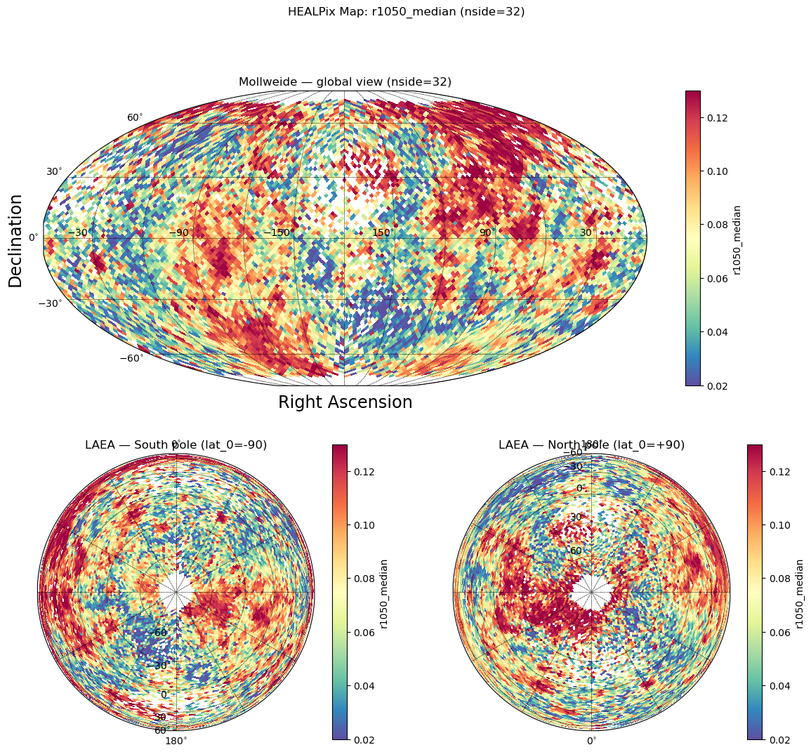

<!-- WARNING: THIS FILE WAS AUTOGENERATED! DO NOT EDIT! -->

## Optional Dependencies

The visualization module requires additional dependencies that are not
installed by default:

- `matplotlib` - Base plotting library
- `scikit-image` - For histogram equalization
- `healpy` (optional) - For native HEALPix projections
- `skyproj` (optional) - For advanced cartographic projections

Install them with:

``` bash
pip install matplotlib scikit-image
pip install healpy skyproj  # optional, for examples
```

## Core Function: prepare_healpix_map

This function prepares a HEALPix map array for visualization by:

1.  Extracting data column as a numpy array
2.  Optionally applying histogram equalization to enhance contrast
3.  Optionally clipping extreme values using percentiles
4.  Creating a matplotlib ScalarMappable for proper colorbars

The function returns both the processed map array (for plotting) and the
ScalarMappable (for colorbars), allowing you to use the original data
range in the colorbar even after histogram equalization.

------------------------------------------------------------------------

### prepare_healpix_map

>      prepare_healpix_map (aggregated_dense:pandas.core.frame.DataFrame,
>                           output_column:str='r1050_median',
>                           equalize:bool=True, percentile_cutoff:Union[float,Tu
>                           ple[float,float],NoneType]=None,
>                           cmap:str='Spectral_r')

\*Prepare a HEALPix map array and ScalarMappable for plotting.

This function processes aggregated HEALPix data for visualization by: -
Extracting the specified column as a numpy array - Optionally applying
histogram equalization (enhances contrast) - Optionally clipping extreme
values using percentiles - Creating a ScalarMappable with original data
range for colorbars\*

<table>
<colgroup>
<col style="width: 6%" />
<col style="width: 25%" />
<col style="width: 34%" />
<col style="width: 34%" />
</colgroup>
<thead>
<tr class="header">
<th></th>
<th><strong>Type</strong></th>
<th><strong>Default</strong></th>
<th><strong>Details</strong></th>
</tr>
</thead>
<tbody>
<tr class="odd">
<td>aggregated_dense</td>
<td>DataFrame</td>
<td></td>
<td>Dense HEALPix aggregated DataFrame (from
densify_healpix_aggregates)</td>
</tr>
<tr class="even">
<td>output_column</td>
<td>str</td>
<td>r1050_median</td>
<td>Column name to visualize</td>
</tr>
<tr class="odd">
<td>equalize</td>
<td>bool</td>
<td>True</td>
<td>Apply histogram equalization for contrast enhancement</td>
</tr>
<tr class="even">
<td>percentile_cutoff</td>
<td>Union</td>
<td>None</td>
<td>Percentile clipping: single value (symmetric) or (min, max)
tuple</td>
</tr>
<tr class="odd">
<td>cmap</td>
<td>str</td>
<td>Spectral_r</td>
<td>Matplotlib colormap name</td>
</tr>
<tr class="even">
<td><strong>Returns</strong></td>
<td><strong>Tuple</strong></td>
<td></td>
<td><strong>Returns: (healpix_map, valid_pixels, invalid_pixels,
mappable)</strong></td>
</tr>
</tbody>
</table>

## Examples

The following examples demonstrate how to use the visualization
utilities. These require additional dependencies (`healpy`, `skyproj`)
that are not part of the core package.

### Setup Test Data

First, let’s create some sample aggregated data to visualize:

``` python
# Create sample aggregated data for examples
from pathlib import Path

# Check for test data
test_data_dir = Path('../test_data')
if test_data_dir.exists():
    # Load sample data and create sidecar
    from shapely import wkb
    import geopandas as gpd
    from healpyxel.sidecar import process_partition
    from healpyxel.aggregate import aggregate_by_sidecar, densify_healpix_aggregates
    
    sample_file = test_data_dir / 'samples' / 'sample_50k.parquet'
    if sample_file.exists():
        # Load and prepare data
        df = pd.read_parquet(sample_file)
        df['geometry'] = df['geometry'].apply(lambda x: wkb.loads(bytes(x)) if x is not None else None)
        gdf = gpd.GeoDataFrame(df, geometry='geometry', crs='EPSG:4326')
        
        # Create sidecar
        nside = 32
        mode = 'fuzzy'
        sidecar_df = process_partition(
            gdf=gdf,
            nside=nside,
            mode=mode,
            base_index=0,
            lon_convention='0_360',
        )
        
        # Aggregate
        df_for_agg = pd.DataFrame(gdf.drop(columns='geometry'))
        aggregated = aggregate_by_sidecar(
            original=df_for_agg,
            sidecar=sidecar_df,
            value_columns=['r1050'],
            aggs=['mean', 'median', 'std'],
            source_id_col='source_id',
            healpix_col='healpix_id',
            min_count=1,
            include_counts=True,
        )
        
        # Densify
        aggregated_dense = densify_healpix_aggregates(
            agg_sparse_df=aggregated,
            nside=nside,
            index_name='healpix_id'
        )
        
        print(f"✓ Prepared test data: {len(aggregated_dense)} HEALPix cells (nside={nside})")
        print(f"  Data cells: {aggregated_dense['r1050_median'].notna().sum()}")
        print(f"  Empty cells: {aggregated_dense['r1050_median'].isna().sum()}")
else:
    print("Test data not found. Examples will be skipped.")
    print("Run: cd .. && bash create_test_data.sh")
```

    2025-12-12 12:59:39,257 INFO Partition (lon_convention=0_360): processed 50000 geometries, dropped 17 (0.0%) total [pre-filter: 17, post-processing: 0]
    2025-12-12 12:59:39,337 INFO Starting aggregation for 1 column(s): ['r1050']
    2025-12-12 12:59:39,338 INFO Aggregation functions: ['mean', 'median', 'std']
    2025-12-12 12:59:39,347 INFO Creating source_id column from DataFrame index
    2025-12-12 12:59:39,399 INFO Sidecar source_id overlap: 49983/49983 (100.0%)
    2025-12-12 12:59:39,400 INFO Merging sidecar with original data
    2025-12-12 12:59:39,405 INFO Grouping by healpix_id and computing aggregations
    2025-12-12 12:59:39,473 INFO Processing 10825 HEALPix cells
    2025-12-12 12:59:41,874 INFO Creating output DataFrame with 10825 cells
    2025-12-12 12:59:41,897 INFO Aggregation complete. Output shape: (10825, 4)
    2025-12-12 12:59:41,906 INFO Densified to 12288 cells (added 1463 empty cells)

    Aggregating HEALPix cells:   0%|          | 0/10825 [00:00<?, ?cell/s]

    ✓ Prepared test data: 12288 HEALPix cells (nside=32)
      Data cells: 10825
      Empty cells: 1463

### Example 1: Basic Usage with Healpy

Simple orthographic projection using healpy:

``` python
if HEALPY_AVAILABLE and 'aggregated_dense' in locals():
    # Prepare the map
    output_column = 'r1050_median'
    healpix_map, valid_pixels, invalid_pixels, mappable = prepare_healpix_map(
        aggregated_dense,
        output_column=output_column,
        equalize=True,
        cmap='Spectral_r'
    )
    
    # Plot with healpy
    order = 'nested'  # healpyxel default
    nest_flag = (order == 'nested')
    
    ax = healpy.visufunc.orthview(
        healpix_map,
        nest=nest_flag,
        title=f'HEALPix Map of {output_column} (nside={nside}, order={order})',
        cmap='Spectral_r',
        flip='geo',
        norm='None',
        xsize=2500
    )
    healpy.visufunc.graticule()
else:
    print("Skipping: healpy not available or no test data")
```

    2025-12-12 12:59:42,910 INFO 0.0 180.0 -180.0 180.0
    2025-12-12 12:59:42,911 INFO The interval between parallels is 30 deg -0.00'.
    2025-12-12 12:59:42,911 INFO The interval between meridians is 30 deg -0.00'.


### Example 2: Multi-Panel Plot with Skyproj

Advanced visualization with multiple projections (Mollweide + polar
views):

``` python
if SKYPROJ_AVAILABLE and HEALPY_AVAILABLE and 'aggregated_dense' in locals():
    from matplotlib import pyplot as plt
    
    # Prepare the map
    output_column = 'r1050_median'
    healpix_map, valid_pixels, invalid_pixels, mappable = prepare_healpix_map(
        aggregated_dense,
        output_column=output_column,
        equalize=True,
        cmap='Spectral_r'
    )
    
    # Mark invalid pixels for healpy
    healpix_map[invalid_pixels] = healpy.UNSEEN
    
    # Create figure with 3 panels
    fig = plt.figure(figsize=(14, 12))
    gs = fig.add_gridspec(2, 2, height_ratios=[1, 1])
    
    order = 'nested'
    nest_flag = (order == 'nested')
    
    # Top row: full-width Mollweide projection
    ax_top = fig.add_subplot(gs[0, :])
    sp_moll = skyproj.MollweideSkyproj(ax=ax_top, lon_0=-180, longitude_ticks='symmetric')
    _ = sp_moll.draw_hpxmap(
        healpix_map,
        nest=nest_flag,
        cmap='Spectral_r',
        zoom=True,
    )
    fig.colorbar(mappable, ax=sp_moll.ax, orientation='vertical', label=output_column)
    sp_moll.ax.set_title(f'Mollweide — global view (nside={nside})')
    
    # Bottom-left: LAEA centered on South pole
    ax_bl = fig.add_subplot(gs[1, 0])
    sp_south = skyproj.LaeaSkyproj(ax=ax_bl, lat_0=-90.0)
    _ = sp_south.draw_hpxmap(
        healpix_map,
        nest=nest_flag,
        cmap='Spectral_r',
        zoom=True,
    )
    fig.colorbar(mappable, ax=sp_south.ax, orientation='vertical', label=output_column)
    sp_south.ax.set_title('LAEA — South pole (lat_0=-90)')
    
    # Bottom-right: LAEA centered on North pole
    ax_br = fig.add_subplot(gs[1, 1])
    sp_north = skyproj.LaeaSkyproj(ax=ax_br, lat_0=90.0)
    _ = sp_north.draw_hpxmap(
        healpix_map,
        nest=nest_flag,
        cmap='Spectral_r',
        zoom=True,
    )
    fig.colorbar(mappable, ax=sp_north.ax, orientation='vertical', label=output_column)
    sp_north.ax.set_title('LAEA — North pole (lat_0=+90)')
    
    plt.suptitle(f'HEALPix Map: {output_column} (nside={nside})');
else:
    print("Skipping: skyproj/healpy not available or no test data")
```



### Example 3: Percentile Clipping

Remove extreme outliers before visualization:

``` python
if 'aggregated_dense' in locals():
    # Clip at 5% and 95% percentiles
    healpix_map, valid, invalid, mappable = prepare_healpix_map(
        aggregated_dense,
        output_column='r1050_median',
        equalize=True,
        percentile_cutoff=5  # Symmetric: [5%, 95%]
    )
    
    # Or asymmetric clipping
    healpix_map, valid, invalid, mappable = prepare_healpix_map(
        aggregated_dense,
        output_column='r1050_median',
        equalize=True,
        percentile_cutoff=(2, 98)  # Asymmetric: [2%, 98%]
    )
    
    print(f"✓ Prepared map with percentile clipping")
    print(f"  Valid pixels: {valid.sum()}")
    print(f"  Invalid pixels: {invalid.sum()}")
else:
    print("Skipping: no test data available")
```

    ✓ Prepared map with percentile clipping
      Valid pixels: 10825
      Invalid pixels: 1463
