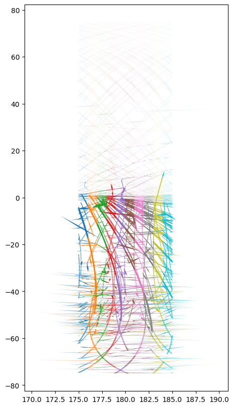
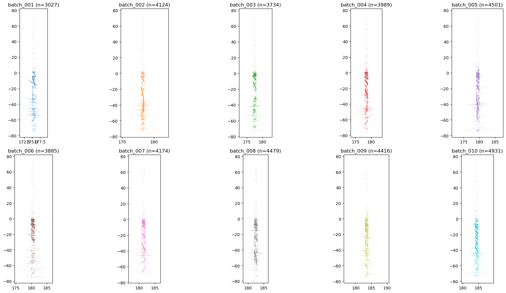
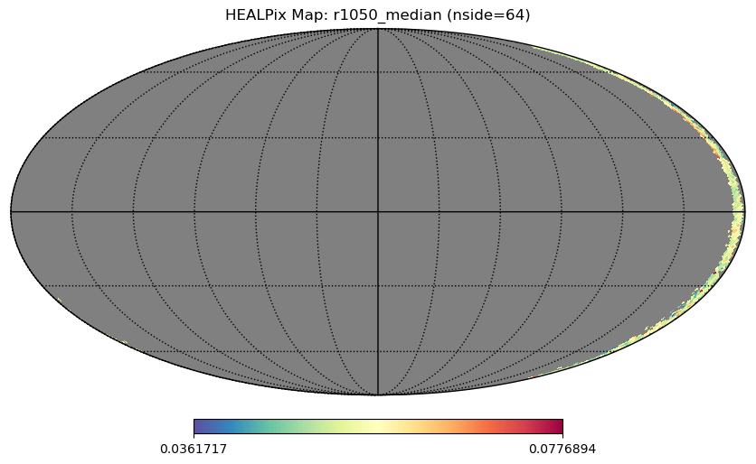

# Streaming Accumulation - WIP!


<!-- WARNING: THIS FILE WAS AUTOGENERATED! DO NOT EDIT! -->

``` python
import healpyxel
from healpyxel.sidecar import process_partition
from healpyxel.aggregate import aggregate_by_sidecar, densify_healpix_aggregates
import pandas as pd
import numpy as np
import geopandas as gpd
from pathlib import Path
from shapely import wkb

print(f"healpyxel version: {healpyxel.__version__}")
```

    healpyxel version: 0.1.0

## Test Data Discovery

Find available batch data files:

``` python
# Look for test data
test_data_dir = Path('../test_data')
batches_dir = test_data_dir / 'batches'

if batches_dir.exists():
    batch_files = sorted(batches_dir.glob('batch_*.parquet'))
    print(f"Found {len(batch_files)} batch files!")
    print(f"\nFirst few batches:")
    for f in batch_files:
        size_mb = f.stat().st_size / 1024 / 1024
        print(f"  {f.name}: {size_mb:.2f} MB")
else:
    print("Batch data not found. Run create_test_data.sh to generate test data.")
    batch_files = []
```

    Found 10 batch files!

    First few batches:
      batch_001.parquet: 1.12 MB
      batch_002.parquet: 1.51 MB
      batch_003.parquet: 1.37 MB
      batch_004.parquet: 1.46 MB
      batch_005.parquet: 1.66 MB
      batch_006.parquet: 1.42 MB
      batch_007.parquet: 1.53 MB
      batch_008.parquet: 1.64 MB
      batch_009.parquet: 1.61 MB
      batch_010.parquet: 1.80 MB

``` python
from healpyxel.geospatial import is_geometry_valid

batch_files_loaded = [
    gdf[gdf['geometry'].apply(is_geometry_valid)]
    for gdf in (gpd.read_parquet(f) for f in batch_files)
]

import rich 
print("Number of geometries in each batch:")
rich.print({k.stem : len(gdf) for k, gdf in zip(batch_files, batch_files_loaded)})
```

    Number of geometries in each batch:

<pre style="white-space:pre;overflow-x:auto;line-height:normal;font-family:Menlo,'DejaVu Sans Mono',consolas,'Courier New',monospace"><span style="font-weight: bold">{</span>
    <span style="color: #008000; text-decoration-color: #008000">'batch_001'</span>: <span style="color: #008080; text-decoration-color: #008080; font-weight: bold">3027</span>,
    <span style="color: #008000; text-decoration-color: #008000">'batch_002'</span>: <span style="color: #008080; text-decoration-color: #008080; font-weight: bold">4124</span>,
    <span style="color: #008000; text-decoration-color: #008000">'batch_003'</span>: <span style="color: #008080; text-decoration-color: #008080; font-weight: bold">3734</span>,
    <span style="color: #008000; text-decoration-color: #008000">'batch_004'</span>: <span style="color: #008080; text-decoration-color: #008080; font-weight: bold">3989</span>,
    <span style="color: #008000; text-decoration-color: #008000">'batch_005'</span>: <span style="color: #008080; text-decoration-color: #008080; font-weight: bold">4501</span>,
    <span style="color: #008000; text-decoration-color: #008000">'batch_006'</span>: <span style="color: #008080; text-decoration-color: #008080; font-weight: bold">3885</span>,
    <span style="color: #008000; text-decoration-color: #008000">'batch_007'</span>: <span style="color: #008080; text-decoration-color: #008080; font-weight: bold">4174</span>,
    <span style="color: #008000; text-decoration-color: #008000">'batch_008'</span>: <span style="color: #008080; text-decoration-color: #008080; font-weight: bold">4479</span>,
    <span style="color: #008000; text-decoration-color: #008000">'batch_009'</span>: <span style="color: #008080; text-decoration-color: #008080; font-weight: bold">4416</span>,
    <span style="color: #008000; text-decoration-color: #008000">'batch_010'</span>: <span style="color: #008080; text-decoration-color: #008080; font-weight: bold">4931</span>
<span style="font-weight: bold">}</span>
</pre>

``` python
import matplotlib.pyplot as plt
```

``` python
fig, ax = plt.subplots(figsize=(20, 10))
colors = plt.cm.tab10.colors  # Use a colormap for distinct colors
for i, gdf in enumerate(batch_files_loaded):
    gdf.plot(ax=ax, color=colors[i % len(colors)], linewidth=3)
    # axs[i].set_xlim(150, 180)
ax.set_aspect(0.25)  # Ensure the aspect ratio of the figure is respected
```



``` python
fig, axs = plt.subplots(nrows=2,ncols=5, figsize=(20, 10))
colors = plt.cm.tab10.colors  # Use a colormap for distinct colors
axs = axs.flatten()  # Flatten the 2D array of axes for easy iteration
for i, gdf in enumerate(batch_files_loaded):
    gdf.plot(ax=axs[i], color=colors[i % len(colors)], linewidth=3)
    # axs[i].set_xlim(150, 180)
    axs[i].set_aspect(0.25)  # Ensure the aspect ratio of the figure is respected
    axs[i].set_title(f"{batch_files[i].stem} (n={len(gdf)})")

plt.tight_layout()
```



## Step 1: Create Sidecar for Each Batch

Process each batch file to create HEALPix assignments:

``` python
# Configuration
nside = 32  # HEALPix resolution
mode = 'fuzzy'  # Assignment mode
lon_convention = '0_360'  # Longitude range of input data

# Process first few batches as demonstration (adjust as needed)
n_batches_to_process = len(batch_files_loaded)

sidecars = []
for i, gdf in enumerate(batch_files_loaded[:n_batches_to_process]):
    print(f"\n[{i+1}/{n_batches_to_process}] Processing batch {i+1}...")

    # Ensure the GeoDataFrame has valid geometries
    if gdf.empty or 'geometry' not in gdf.columns:
        print(f"  ⚠️  No valid geometry column found in batch {i+1}, skipping...")
        continue

    # Create sidecar
    sidecar = process_partition(
        gdf=gdf,
        nside=nside,
        mode=mode,
        base_index=0,
        lon_convention=lon_convention  # Use lon_convention instead of lat_min/lat_max
    )
    
    # Store with batch info
    sidecar['batch'] = i
    sidecars.append(sidecar)
    
    print(f"  ✓ Created {len(sidecar)} assignments from {len(gdf)} geometries")
    print(f"    Unique cells: {sidecar['healpix_id'].nunique()}")

# Combine all sidecars if any were created
if sidecars:
    combined_sidecar = pd.concat(sidecars, ignore_index=True)
    print(f"\n{'='*60}")
    print(f"Combined sidecar: {len(combined_sidecar)} total assignments")
    print(f"Unique cells touched: {combined_sidecar['healpix_id'].nunique()}")
    print(f"Unique sources: {combined_sidecar['source_id'].nunique()}")
else:
    print("\nNo sidecars created. Check that batch files exist and have valid geometry columns.")
```


    [1/10] Processing batch 1...
      ✓ Created 3539 assignments from 3027 geometries
        Unique cells: 157

    [2/10] Processing batch 2...
      ✓ Created 4782 assignments from 4124 geometries
        Unique cells: 140

    [3/10] Processing batch 3...
      ✓ Created 4304 assignments from 3734 geometries
        Unique cells: 151

    [4/10] Processing batch 4...
      ✓ Created 4565 assignments from 3989 geometries
        Unique cells: 156

    [5/10] Processing batch 5...
      ✓ Created 5308 assignments from 4501 geometries
        Unique cells: 160

    [6/10] Processing batch 6...
      ✓ Created 4552 assignments from 3885 geometries
        Unique cells: 160

    [7/10] Processing batch 7...
      ✓ Created 4874 assignments from 4174 geometries
        Unique cells: 160

    [8/10] Processing batch 8...
      ✓ Created 5205 assignments from 4479 geometries
        Unique cells: 147

    [9/10] Processing batch 9...
      ✓ Created 5134 assignments from 4416 geometries
        Unique cells: 143

    [10/10] Processing batch 10...
      ✓ Created 5632 assignments from 4931 geometries
        Unique cells: 155

    ============================================================
    Combined sidecar: 47895 total assignments
    Unique cells touched: 458
    Unique sources: 4931

## Step 2: Aggregate Data by HEALPix Cells

Now aggregate the original data values by HEALPix cell using the
sidecar:

``` python
# Reload and combine data from processed batches (drop geometry for aggregation)
combined_data_list = []

for i, gdf in enumerate(batch_files_loaded[:n_batches_to_process]):
    print(f"\n[{i+1}/{n_batches_to_process}] Processing batch {i+1}...")

    # Drop geometry column if present (not needed for aggregation)
    if 'geometry' in gdf.columns:
        gdf = gdf.drop(columns=['geometry'])
    
    # Add source_id matching the sidecar creation
    gdf['source_id'] = gdf.index.astype(np.int64)
    gdf['batch'] = i
    combined_data_list.append(gdf)

if combined_data_list:
    combined_data = pd.concat(combined_data_list, ignore_index=True)
    print(f"Combined data: {len(combined_data)} rows")
    print(f"Columns: {list(combined_data.columns)}")
    print(f"\nFirst few rows:")
    display(combined_data.head())
else:
    print("No data combined. Check that batch_files_loaded contains valid data.")
```


    [1/10] Processing batch 1...

    [2/10] Processing batch 2...

    [3/10] Processing batch 3...

    [4/10] Processing batch 4...

    [5/10] Processing batch 5...

    [6/10] Processing batch 6...

    [7/10] Processing batch 7...

    [8/10] Processing batch 8...

    [9/10] Processing batch 9...

    [10/10] Processing batch 10...
    Combined data: 41260 rows
    Columns: ['ref_id', 'a', 'b', 'c', 'd', 'e', 'f', 'g', 'h', 'i', 'j', 'k', 'l', 'm', 'n', 'o', 'p', 'q1', 'q2', 'q3', 'q4', 'obs_id', 'vis_slope', 'nir_slope', 'visnir_slope', 'norm_vis_slope', 'norm_nir_slope', 'norm_visnir_slope', 'curvature', 'norm_curvature', 'uv_downturn', 'color_index_310_390', 'color_index_415_750', 'color_index_750_415', 'color_index_750_950', 'r310', 'r390', 'r750', 'r950', 'r1050', 'r1400', 'r415', 'r433_2', 'r479_9', 'r556_9', 'r628_8', 'r748_7', 'r828_4', 'r898_8', 'r996_2', 'spot_number', 'lat_center', 'lon_center', 'surface', 'width', 'length', 'ang_incidence', 'ang_emission', 'ang_phase', 'azimuth', 'source_id', 'batch']

    First few rows:

<div>
<style scoped>
    .dataframe tbody tr th:only-of-type {
        vertical-align: middle;
    }
&#10;    .dataframe tbody tr th {
        vertical-align: top;
    }
&#10;    .dataframe thead th {
        text-align: right;
    }
</style>

<table class="dataframe" data-quarto-postprocess="true" data-border="1">
<thead>
<tr class="header" style="text-align: right;">
<th data-quarto-table-cell-role="th"></th>
<th data-quarto-table-cell-role="th">ref_id</th>
<th data-quarto-table-cell-role="th">a</th>
<th data-quarto-table-cell-role="th">b</th>
<th data-quarto-table-cell-role="th">c</th>
<th data-quarto-table-cell-role="th">d</th>
<th data-quarto-table-cell-role="th">e</th>
<th data-quarto-table-cell-role="th">f</th>
<th data-quarto-table-cell-role="th">g</th>
<th data-quarto-table-cell-role="th">h</th>
<th data-quarto-table-cell-role="th">i</th>
<th data-quarto-table-cell-role="th">...</th>
<th data-quarto-table-cell-role="th">lon_center</th>
<th data-quarto-table-cell-role="th">surface</th>
<th data-quarto-table-cell-role="th">width</th>
<th data-quarto-table-cell-role="th">length</th>
<th data-quarto-table-cell-role="th">ang_incidence</th>
<th data-quarto-table-cell-role="th">ang_emission</th>
<th data-quarto-table-cell-role="th">ang_phase</th>
<th data-quarto-table-cell-role="th">azimuth</th>
<th data-quarto-table-cell-role="th">source_id</th>
<th data-quarto-table-cell-role="th">batch</th>
</tr>
</thead>
<tbody>
<tr class="odd">
<td data-quarto-table-cell-role="th">0</td>
<td>0801419125400568</td>
<td>0</td>
<td>0</td>
<td>0</td>
<td>0</td>
<td>0</td>
<td>1</td>
<td>0</td>
<td>0</td>
<td>0</td>
<td>...</td>
<td>175.06512</td>
<td>54194396.0</td>
<td>5599.9224</td>
<td>12322.036</td>
<td>9.834717</td>
<td>73.333954</td>
<td>83.013830</td>
<td>154.51570</td>
<td>0</td>
<td>0</td>
</tr>
<tr class="even">
<td data-quarto-table-cell-role="th">1</td>
<td>0801419125400569</td>
<td>0</td>
<td>0</td>
<td>0</td>
<td>0</td>
<td>0</td>
<td>1</td>
<td>0</td>
<td>0</td>
<td>0</td>
<td>...</td>
<td>175.14010</td>
<td>54753300.0</td>
<td>5660.6910</td>
<td>12315.469</td>
<td>9.769003</td>
<td>73.381120</td>
<td>82.985110</td>
<td>154.42958</td>
<td>1</td>
<td>0</td>
</tr>
<tr class="odd">
<td data-quarto-table-cell-role="th">2</td>
<td>0801419125400570</td>
<td>0</td>
<td>0</td>
<td>0</td>
<td>0</td>
<td>0</td>
<td>1</td>
<td>0</td>
<td>0</td>
<td>0</td>
<td>...</td>
<td>175.21364</td>
<td>54823684.0</td>
<td>5736.7520</td>
<td>12167.806</td>
<td>9.704690</td>
<td>73.427300</td>
<td>82.956314</td>
<td>154.33447</td>
<td>2</td>
<td>0</td>
</tr>
<tr class="even">
<td data-quarto-table-cell-role="th">3</td>
<td>0801419125400571</td>
<td>0</td>
<td>0</td>
<td>0</td>
<td>0</td>
<td>0</td>
<td>1</td>
<td>0</td>
<td>0</td>
<td>0</td>
<td>...</td>
<td>175.28458</td>
<td>54962964.0</td>
<td>5861.2773</td>
<td>11939.551</td>
<td>9.641157</td>
<td>73.473150</td>
<td>82.927510</td>
<td>154.23120</td>
<td>3</td>
<td>0</td>
</tr>
<tr class="odd">
<td data-quarto-table-cell-role="th">4</td>
<td>0801419125400572</td>
<td>0</td>
<td>0</td>
<td>0</td>
<td>0</td>
<td>0</td>
<td>1</td>
<td>0</td>
<td>0</td>
<td>0</td>
<td>...</td>
<td>175.35536</td>
<td>55392168.0</td>
<td>5779.1610</td>
<td>12203.761</td>
<td>9.577167</td>
<td>73.520050</td>
<td>82.898830</td>
<td>154.12103</td>
<td>4</td>
<td>0</td>
</tr>
</tbody>
</table>

<p>5 rows × 62 columns</p>
</div>

``` python
# Choose a value column to aggregate (adjust based on your data)
# Common columns in MESSENGER MASCS data: r1050, r750, etc.
value_columns = ['r1050'] if 'r1050' in combined_data.columns else []

if not value_columns:
    # Try to find numeric columns
    numeric_cols = combined_data.select_dtypes(include=[np.number]).columns.tolist()
    # Exclude id and coordinate columns
    exclude = ['source_id', 'batch', 'lat_center', 'lon_center', 'lat', 'lon', 'latitude', 'longitude']
    value_columns = [c for c in numeric_cols if c not in exclude][:1]  # Take first suitable column

print(f"Aggregating column(s): {value_columns}")

if value_columns and sidecars:
    # Perform aggregation
    aggregated = aggregate_by_sidecar(
        original=combined_data,
        sidecar=combined_sidecar,
        value_columns=value_columns,
        aggs=['mean', 'median', 'std', 'mad', 'robust_std'],
        source_id_col='source_id',
        healpix_col='healpix_id',
        min_count=1,
       sentinel_threshold=1e30
    )
    
    print(f"\nAggregated {len(aggregated)} HEALPix cells")
    print(f"Columns: {list(aggregated.columns)}")
    display(aggregated.head(10))
else:
    print("Cannot aggregate: no suitable value columns or no sidecars created")
```

    2026-02-13 13:31:15,506 WARNING Found 36329 duplicate source_id values - keeping first occurrence
    2026-02-13 13:31:15,516 INFO Sidecar source_id overlap: 4931/4931 (100.0%)
    2026-02-13 13:31:15,517 INFO Merging sidecar with original data
    2026-02-13 13:31:15,523 INFO Grouping by healpix_id and computing aggregations
    2026-02-13 13:31:15,531 INFO Processing 458 HEALPix cells
    2026-02-13 13:31:15,728 INFO Aggregation complete: 458 cells with data

    Aggregating column(s): ['r1050']

    Aggregated 458 HEALPix cells
    Columns: ['r1050_mean', 'r1050_median', 'r1050_std', 'r1050_mad', 'r1050_robust_std', 'n_sources']

    Aggregating HEALPix cells:   0%|          | 0/458 [00:00<?, ?cell/s]

<div>
<style scoped>
    .dataframe tbody tr th:only-of-type {
        vertical-align: middle;
    }
&#10;    .dataframe tbody tr th {
        vertical-align: top;
    }
&#10;    .dataframe thead th {
        text-align: right;
    }
</style>

<table class="dataframe" data-quarto-postprocess="true" data-border="1">
<thead>
<tr class="header" style="text-align: right;">
<th data-quarto-table-cell-role="th"></th>
<th data-quarto-table-cell-role="th">r1050_mean</th>
<th data-quarto-table-cell-role="th">r1050_median</th>
<th data-quarto-table-cell-role="th">r1050_std</th>
<th data-quarto-table-cell-role="th">r1050_mad</th>
<th data-quarto-table-cell-role="th">r1050_robust_std</th>
<th data-quarto-table-cell-role="th">n_sources</th>
</tr>
<tr class="odd">
<th data-quarto-table-cell-role="th">healpix_id</th>
<th data-quarto-table-cell-role="th"></th>
<th data-quarto-table-cell-role="th"></th>
<th data-quarto-table-cell-role="th"></th>
<th data-quarto-table-cell-role="th"></th>
<th data-quarto-table-cell-role="th"></th>
<th data-quarto-table-cell-role="th"></th>
</tr>
</thead>
<tbody>
<tr class="odd">
<td data-quarto-table-cell-role="th">1360</td>
<td>0.064800</td>
<td>0.064958</td>
<td>0.002333</td>
<td>0.002149</td>
<td>0.003187</td>
<td>4</td>
</tr>
<tr class="even">
<td data-quarto-table-cell-role="th">1361</td>
<td>0.056111</td>
<td>0.053312</td>
<td>0.009071</td>
<td>0.006254</td>
<td>0.009272</td>
<td>67</td>
</tr>
<tr class="odd">
<td data-quarto-table-cell-role="th">1364</td>
<td>0.052999</td>
<td>0.052222</td>
<td>0.009556</td>
<td>0.005086</td>
<td>0.007540</td>
<td>121</td>
</tr>
<tr class="even">
<td data-quarto-table-cell-role="th">1365</td>
<td>0.055351</td>
<td>0.052325</td>
<td>0.011867</td>
<td>0.002711</td>
<td>0.004019</td>
<td>84</td>
</tr>
<tr class="odd">
<td data-quarto-table-cell-role="th">1366</td>
<td>0.061883</td>
<td>0.062385</td>
<td>0.008684</td>
<td>0.006037</td>
<td>0.008951</td>
<td>86</td>
</tr>
<tr class="even">
<td data-quarto-table-cell-role="th">1367</td>
<td>0.051103</td>
<td>0.050074</td>
<td>0.006332</td>
<td>0.002375</td>
<td>0.003521</td>
<td>116</td>
</tr>
<tr class="odd">
<td data-quarto-table-cell-role="th">1372</td>
<td>0.058407</td>
<td>0.058615</td>
<td>0.007742</td>
<td>0.005122</td>
<td>0.007594</td>
<td>116</td>
</tr>
<tr class="even">
<td data-quarto-table-cell-role="th">1373</td>
<td>0.052792</td>
<td>0.052738</td>
<td>0.009365</td>
<td>0.004715</td>
<td>0.006991</td>
<td>143</td>
</tr>
<tr class="odd">
<td data-quarto-table-cell-role="th">1374</td>
<td>0.056128</td>
<td>0.054841</td>
<td>0.006303</td>
<td>0.004398</td>
<td>0.006521</td>
<td>111</td>
</tr>
<tr class="even">
<td data-quarto-table-cell-role="th">1375</td>
<td>0.055762</td>
<td>0.054951</td>
<td>0.008210</td>
<td>0.006297</td>
<td>0.009336</td>
<td>134</td>
</tr>
</tbody>
</table>

</div>

## Step 3: Densify for Complete HEALPix Grid

Fill in empty cells to create a complete HEALPix map:

``` python
if value_columns and sidecars:
    # Densify the sparse aggregated data
    aggregated_dense = densify_healpix_aggregates(
        agg_sparse_df=aggregated,
        nside=nside,
        healpix_col='healpix_id'
    )
    
    total_cells = 12 * nside ** 2
    filled_cells = aggregated[f'{value_columns[0]}_mean'].notna().sum()
    empty_cells = total_cells - filled_cells
    
    print(f"HEALPix Grid (nside={nside}):")
    print(f"  Total cells: {total_cells}")
    print(f"  Cells with data: {filled_cells}")
    print(f"  Empty cells: {empty_cells}")
    print(f"  Coverage: {100 * filled_cells / total_cells:.2f}%")
    
    display(aggregated_dense.head(10))
```

    2026-02-13 13:31:35,234 INFO Densified from 458 to 12288 cells (nside=32)

    HEALPix Grid (nside=32):
      Total cells: 12288
      Cells with data: 458
      Empty cells: 11830
      Coverage: 3.73%

<div>
<style scoped>
    .dataframe tbody tr th:only-of-type {
        vertical-align: middle;
    }
&#10;    .dataframe tbody tr th {
        vertical-align: top;
    }
&#10;    .dataframe thead th {
        text-align: right;
    }
</style>

<table class="dataframe" data-quarto-postprocess="true" data-border="1">
<thead>
<tr class="header" style="text-align: right;">
<th data-quarto-table-cell-role="th"></th>
<th data-quarto-table-cell-role="th">r1050_mean</th>
<th data-quarto-table-cell-role="th">r1050_median</th>
<th data-quarto-table-cell-role="th">r1050_std</th>
<th data-quarto-table-cell-role="th">r1050_mad</th>
<th data-quarto-table-cell-role="th">r1050_robust_std</th>
<th data-quarto-table-cell-role="th">n_sources</th>
</tr>
<tr class="odd">
<th data-quarto-table-cell-role="th">healpix_id</th>
<th data-quarto-table-cell-role="th"></th>
<th data-quarto-table-cell-role="th"></th>
<th data-quarto-table-cell-role="th"></th>
<th data-quarto-table-cell-role="th"></th>
<th data-quarto-table-cell-role="th"></th>
<th data-quarto-table-cell-role="th"></th>
</tr>
</thead>
<tbody>
<tr class="odd">
<td data-quarto-table-cell-role="th">0</td>
<td>NaN</td>
<td>NaN</td>
<td>NaN</td>
<td>NaN</td>
<td>NaN</td>
<td>NaN</td>
</tr>
<tr class="even">
<td data-quarto-table-cell-role="th">1</td>
<td>NaN</td>
<td>NaN</td>
<td>NaN</td>
<td>NaN</td>
<td>NaN</td>
<td>NaN</td>
</tr>
<tr class="odd">
<td data-quarto-table-cell-role="th">2</td>
<td>NaN</td>
<td>NaN</td>
<td>NaN</td>
<td>NaN</td>
<td>NaN</td>
<td>NaN</td>
</tr>
<tr class="even">
<td data-quarto-table-cell-role="th">3</td>
<td>NaN</td>
<td>NaN</td>
<td>NaN</td>
<td>NaN</td>
<td>NaN</td>
<td>NaN</td>
</tr>
<tr class="odd">
<td data-quarto-table-cell-role="th">4</td>
<td>NaN</td>
<td>NaN</td>
<td>NaN</td>
<td>NaN</td>
<td>NaN</td>
<td>NaN</td>
</tr>
<tr class="even">
<td data-quarto-table-cell-role="th">5</td>
<td>NaN</td>
<td>NaN</td>
<td>NaN</td>
<td>NaN</td>
<td>NaN</td>
<td>NaN</td>
</tr>
<tr class="odd">
<td data-quarto-table-cell-role="th">6</td>
<td>NaN</td>
<td>NaN</td>
<td>NaN</td>
<td>NaN</td>
<td>NaN</td>
<td>NaN</td>
</tr>
<tr class="even">
<td data-quarto-table-cell-role="th">7</td>
<td>NaN</td>
<td>NaN</td>
<td>NaN</td>
<td>NaN</td>
<td>NaN</td>
<td>NaN</td>
</tr>
<tr class="odd">
<td data-quarto-table-cell-role="th">8</td>
<td>NaN</td>
<td>NaN</td>
<td>NaN</td>
<td>NaN</td>
<td>NaN</td>
<td>NaN</td>
</tr>
<tr class="even">
<td data-quarto-table-cell-role="th">9</td>
<td>NaN</td>
<td>NaN</td>
<td>NaN</td>
<td>NaN</td>
<td>NaN</td>
<td>NaN</td>
</tr>
</tbody>
</table>

</div>

## Step 4: Visualize HEALPix Map

Create a visualization of the aggregated data:

``` python
if value_columns and sidecars:
    import healpy as hp
    import matplotlib.pyplot as plt
    
    # Choose which statistic to visualize
    stat_column = f'{value_columns[0]}_median'
    
    # Extract map values (NaN for empty cells)
    healpix_map = aggregated_dense[stat_column].values.astype(float)
    
    # Create visualization
    plt.figure(figsize=(12, 8))
    hp.mollview(
        healpix_map,
        nest=True,
        title=f'HEALPix Map: {stat_column} (nside={nside})',
        cmap='Spectral_r',
        flip='geo',
        xsize=2000
    )
    hp.graticule()
    plt.show()
    
    # Statistics of the mapped data
    valid_data = healpix_map[~np.isnan(healpix_map)]
    print(f"\nMap Statistics:")
    print(f"  Min: {valid_data.min():.4f}")
    print(f"  Max: {valid_data.max():.4f}")
    print(f"  Mean: {valid_data.mean():.4f}")
    print(f"  Median: {np.median(valid_data):.4f}")
```

    2025-12-11 15:11:07,965 INFO 0.0 180.0 -180.0 180.0
    2025-12-11 15:11:07,966 INFO The interval between parallels is 30 deg -0.00'.
    2025-12-11 15:11:07,967 INFO The interval between meridians is 30 deg -0.00'.
    2025-12-11 15:11:07,966 INFO The interval between parallels is 30 deg -0.00'.
    2025-12-11 15:11:07,967 INFO The interval between meridians is 30 deg -0.00'.

    <Figure size 1200x800 with 0 Axes>




    Map Statistics:
      Min: 0.0362
      Max: 0.0777
      Mean: 0.0535
      Median: 0.0527

## Summary

This notebook demonstrated the complete healpyxel workflow:

1.  **Sidecar Creation**: Assigned HEALPix cells to geometries using
    `process_partition()`
2.  **Aggregation**: Computed statistics per cell using
    `aggregate_by_sidecar()`
3.  **Densification**: Created complete grid using
    `densify_healpix_aggregates()`
4.  **Visualization**: Displayed the final HEALPix map

### For Large Datasets

For processing many batch files efficiently, use the CLI tools:

``` bash
# Process all batches with sidecar creation
for batch in test_data/batches/batch_*.parquet; do
    healpix_sidecar --input "$batch" \
                    --nside 32 64 \
                    --mode fuzzy \
                    --lon-convention 0_360 \
                    --ncores 4
done

# Aggregate all data
healpix_aggregate --input test_data/batches/ \
                  --pattern "*.parquet" \
                  --nside 32 \
                  --output aggregated_nside32.parquet

# Finalize maps
healpix_finalize --input aggregated_nside32.parquet \
                 --nside 32 \
                 --output final_maps/
```

### Next Steps

- Experiment with different `nside` values for different resolutions
- Try both ‘strict’ and ‘fuzzy’ assignment modes
- Aggregate multiple value columns simultaneously
- Use `finalize_maps()` to create production-ready map products
