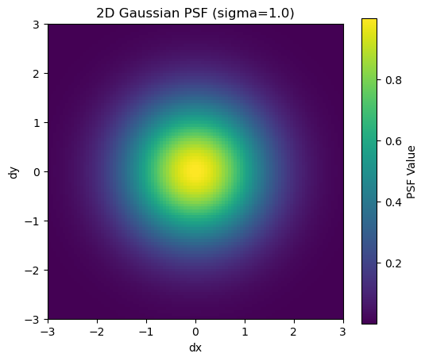
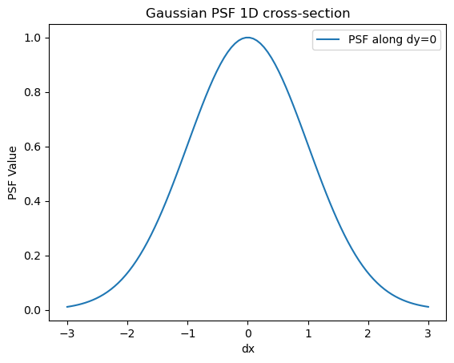
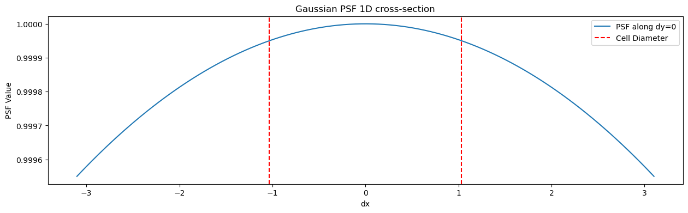
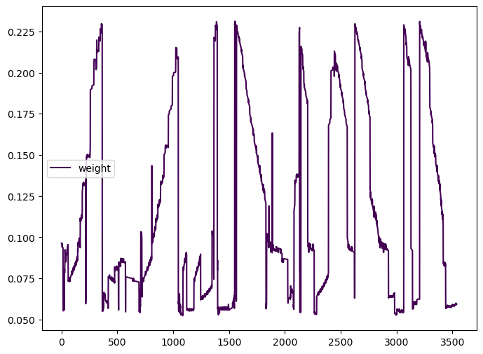
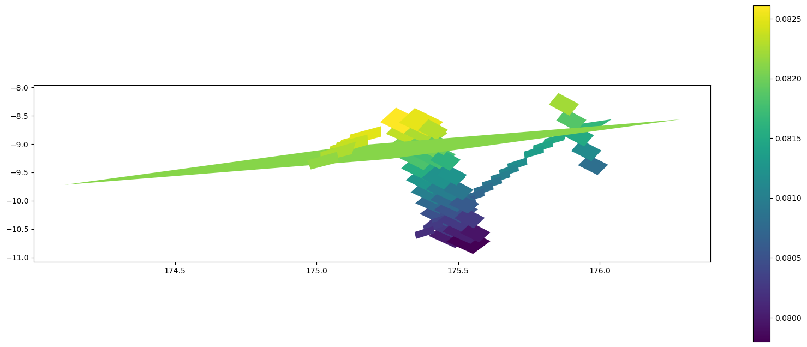
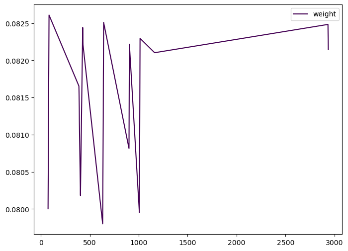
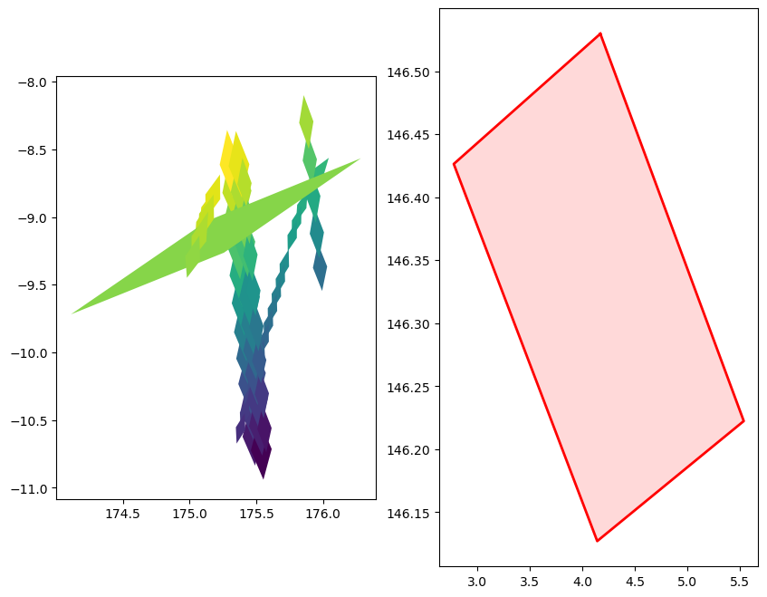

# Gaussian PSF - WIP!


<!-- WARNING: THIS FILE WAS AUTOGENERATED! DO NOT EDIT! -->

``` python
# Import the GaussianPSF class from healpyxel.sidecar
from healpyxel.sidecar import GaussianPSF

import numpy as np
import matplotlib.pyplot as plt
```

``` python
# Create a Gaussian PSF with a chosen sigma
sigma = 1.0
psf = GaussianPSF(sigma=sigma)

# Create a grid of (dx, dy) values
grid_size = 100
extent = 3 * sigma
x = np.linspace(-extent, extent, grid_size)
y = np.linspace(-extent, extent, grid_size)
dx, dy = np.meshgrid(x, y)

# Evaluate the PSF on the grid
z = psf(dx, dy)
```

``` python
plt.figure(figsize=(6, 5))
plt.imshow(z, extent=[-extent, extent, -extent, extent], origin='lower', cmap='viridis')
plt.colorbar(label='PSF Value')
plt.title(f'2D Gaussian PSF (sigma={sigma})')
plt.xlabel('dx')
plt.ylabel('dy')
plt.show()
```



``` python
plt.figure()
plt.plot(x, psf(x, 0), label='PSF along dy=0')
plt.title('Gaussian PSF 1D cross-section')
plt.xlabel('dx')
plt.ylabel('PSF Value')
plt.legend()
plt.show()
```



``` python
from pathlib import Path

# Look for test data
test_data_dir = Path('../test_data')
if test_data_dir.exists():
    print("Test data directory found!")
    print(f"\nContents:")
    for item in sorted(test_data_dir.iterdir()):
        if item.is_file():
            size_mb = item.stat().st_size / 1024 / 1024
            print(f"  {item.name}: {size_mb:.2f} MB")
        elif item.is_dir():
            n_files = len(list(item.glob('*')))
            print(f"  {item.name}/: {n_files} files")
else:
    print("Test data directory not found. Run create_test_data.sh to generate test data.")
```

    Test data directory found!

    Contents:
      README.md: 0.00 MB
      batches/: 10 files
      derived/: 1 files
      regions/: 0 files
      samples/: 3 files
      validation/: 2 files

``` python
from healpyxel.sidecar import process_partition, write_coalesced_output, get_psf
import pandas as pd
from pathlib import Path
import geopandas as gpd
from shapely import wkb

# Load your test data
input_path = test_data_dir / 'batches' / 'batch_001.parquet'
# Read as regular pandas DataFrame first (geometry is stored as WKB binary)
df = pd.read_parquet(input_path)

print(f"Loaded {len(df)} rows")
print(f"Columns: {list(df.columns)}")

# Convert WKB geometry column to shapely geometries
if 'geometry' in df.columns:
    print("\nConverting WKB geometry to GeoDataFrame...")
    df['geometry'] = df['geometry'].apply(lambda x: wkb.loads(bytes(x)) if x is not None else None)
    gdf = gpd.GeoDataFrame(df, geometry='geometry', crs='EPSG:4326')
    print(f"CRS: {gdf.crs}")
else:
    print("\nNo geometry column found!")
    gdf = df

# Show first few rows
gdf.head(3)
```

    Loaded 3029 rows
    Columns: ['ref_id', 'a', 'b', 'c', 'd', 'e', 'f', 'g', 'h', 'i', 'j', 'k', 'l', 'm', 'n', 'o', 'p', 'q1', 'q2', 'q3', 'q4', 'obs_id', 'vis_slope', 'nir_slope', 'visnir_slope', 'norm_vis_slope', 'norm_nir_slope', 'norm_visnir_slope', 'curvature', 'norm_curvature', 'uv_downturn', 'color_index_310_390', 'color_index_415_750', 'color_index_750_415', 'color_index_750_950', 'r310', 'r390', 'r750', 'r950', 'r1050', 'r1400', 'r415', 'r433_2', 'r479_9', 'r556_9', 'r628_8', 'r748_7', 'r828_4', 'r898_8', 'r996_2', 'spot_number', 'lat_center', 'lon_center', 'surface', 'width', 'length', 'ang_incidence', 'ang_emission', 'ang_phase', 'azimuth', 'geometry']

    Converting WKB geometry to GeoDataFrame...
    CRS: EPSG:4326

<div>
<style scoped>
    .dataframe tbody tr th:only-of-type {
        vertical-align: middle;
    }
&#10;    .dataframe tbody tr th {
        vertical-align: top;
    }
&#10;    .dataframe thead th {
        text-align: right;
    }
</style>

<table class="dataframe" data-quarto-postprocess="true" data-border="1">
<thead>
<tr class="header" style="text-align: right;">
<th data-quarto-table-cell-role="th"></th>
<th data-quarto-table-cell-role="th">ref_id</th>
<th data-quarto-table-cell-role="th">a</th>
<th data-quarto-table-cell-role="th">b</th>
<th data-quarto-table-cell-role="th">c</th>
<th data-quarto-table-cell-role="th">d</th>
<th data-quarto-table-cell-role="th">e</th>
<th data-quarto-table-cell-role="th">f</th>
<th data-quarto-table-cell-role="th">g</th>
<th data-quarto-table-cell-role="th">h</th>
<th data-quarto-table-cell-role="th">i</th>
<th data-quarto-table-cell-role="th">...</th>
<th data-quarto-table-cell-role="th">lat_center</th>
<th data-quarto-table-cell-role="th">lon_center</th>
<th data-quarto-table-cell-role="th">surface</th>
<th data-quarto-table-cell-role="th">width</th>
<th data-quarto-table-cell-role="th">length</th>
<th data-quarto-table-cell-role="th">ang_incidence</th>
<th data-quarto-table-cell-role="th">ang_emission</th>
<th data-quarto-table-cell-role="th">ang_phase</th>
<th data-quarto-table-cell-role="th">azimuth</th>
<th data-quarto-table-cell-role="th">geometry</th>
</tr>
</thead>
<tbody>
<tr class="odd">
<td data-quarto-table-cell-role="th">0</td>
<td>0801419125400568</td>
<td>0</td>
<td>0</td>
<td>0</td>
<td>0</td>
<td>0</td>
<td>1</td>
<td>0</td>
<td>0</td>
<td>0</td>
<td>...</td>
<td>1.069630</td>
<td>175.06512</td>
<td>54194396.0</td>
<td>5599.9224</td>
<td>12322.036</td>
<td>9.834717</td>
<td>73.333954</td>
<td>83.013830</td>
<td>154.51570</td>
<td>POLYGON ((175.18568 1.15206, 175.0281 1.12375,...</td>
</tr>
<tr class="even">
<td data-quarto-table-cell-role="th">1</td>
<td>0801419125400569</td>
<td>0</td>
<td>0</td>
<td>0</td>
<td>0</td>
<td>0</td>
<td>1</td>
<td>0</td>
<td>0</td>
<td>0</td>
<td>...</td>
<td>1.121209</td>
<td>175.14010</td>
<td>54753300.0</td>
<td>5660.6910</td>
<td>12315.469</td>
<td>9.769003</td>
<td>73.381120</td>
<td>82.985110</td>
<td>154.42958</td>
<td>POLYGON ((175.25902 1.20378, 175.10211 1.17589...</td>
</tr>
<tr class="odd">
<td data-quarto-table-cell-role="th">2</td>
<td>0801419125400570</td>
<td>0</td>
<td>0</td>
<td>0</td>
<td>0</td>
<td>0</td>
<td>1</td>
<td>0</td>
<td>0</td>
<td>0</td>
<td>...</td>
<td>1.173109</td>
<td>175.21364</td>
<td>54823684.0</td>
<td>5736.7520</td>
<td>12167.806</td>
<td>9.704690</td>
<td>73.427300</td>
<td>82.956314</td>
<td>154.33447</td>
<td>POLYGON ((175.32878 1.25573, 175.1742 1.22806,...</td>
</tr>
</tbody>
</table>

<p>3 rows × 61 columns</p>
</div>

``` python
gdf['lon_center'].describe()
```

    count    3029.000000
    mean      175.486985
    std         0.295076
    min       175.000180
    25%       175.228490
    50%       175.482590
    75%       175.747380
    max       175.999080
    Name: lon_center, dtype: float64

``` python
import numpy as np

def healpix_cell_diameter_deg(nside):
    # Area of a HEALPix cell (steradians)
    area_sr = 4 * np.pi / (12 * nside * nside)
    # Convert to square degrees
    area_deg2 = area_sr * (180/np.pi)**2
    # Equivalent diameter (degrees) for a circle of this area
    diameter_deg = 2 * np.sqrt(area_deg2 / np.pi)
    return diameter_deg
```

``` python
# Set parameters
nside = 32
mode = "fuzzy"
lon_convention = "0_360"
sigma_level = 0.01  # Number of sigma to cover the cell
cell_radius = healpix_cell_diameter_deg(nside) / 2
sigma = cell_radius / sigma_level
cell_psf = get_psf("gaussian", sigma=sigma)  # You can adjust sigma as needed
print(f"{cell_radius=}")
print(f"{sigma_level=}")
print(f"{sigma=:}")
```

    cell_radius=np.float64(1.03374167891586)
    sigma_level=0.01
    sigma=103.374167891586

``` python
plt.figure()
x = np.linspace(-3* cell_radius, 3*cell_radius, 200)
plt.figure(figsize=(15,4))
plt.plot(x, cell_psf(x, 0), label='PSF along dy=0')
# put vertical lines at +/- cell_diameter
plt.axvline(cell_radius, color='r', linestyle='--', label='Cell Diameter ')
plt.axvline(-cell_radius, color='r', linestyle='--')
plt.title('Gaussian PSF 1D cross-section')
plt.xlabel('dx')
plt.ylabel('PSF Value')
plt.legend()
plt.show()
```

    <Figure size 640x480 with 0 Axes>



``` python
processed_partition = process_partition(
    gdf, 
    nside, 
    mode, 
    base_index=None,
    lon_convention=lon_convention,
    data_psf=None,
    cell_psf=cell_psf
    )

print(processed_partition.describe())
```

    2026-02-03 13:20:07,357 INFO Partition (lon_convention=0_360): processed 3029 geometries, dropped 2 (0.1%) total [pre-filter: 2, post-processing: 0]

             source_id   healpix_id       weight
    count  3539.000000       3539.0  3539.000000
    mean   1484.089008  5784.662617     0.116974
    std     877.023929  2786.253912     0.056835
    min       0.000000       1360.0     0.052385
    25%     723.500000       1887.0     0.068813
    50%    1467.000000       6381.0     0.092915
    75%    2249.500000       7114.0     0.171715
    max    3028.000000       9588.0     0.231170

``` python
processed_partition['weight'].plot( cmap='viridis', figsize=(8,6), legend=True)
```



``` python
processed_partition.groupby('healpix_id').agg(len)[['weight']].sort_values(by='weight', ascending=False).head(10)
```

<div>
<style scoped>
    .dataframe tbody tr th:only-of-type {
        vertical-align: middle;
    }
&#10;    .dataframe tbody tr th {
        vertical-align: top;
    }
&#10;    .dataframe thead th {
        text-align: right;
    }
</style>

<table class="dataframe" data-quarto-postprocess="true" data-border="1">
<thead>
<tr class="header" style="text-align: right;">
<th data-quarto-table-cell-role="th"></th>
<th data-quarto-table-cell-role="th">weight</th>
</tr>
<tr class="odd">
<th data-quarto-table-cell-role="th">healpix_id</th>
<th data-quarto-table-cell-role="th"></th>
</tr>
</thead>
<tbody>
<tr class="odd">
<td data-quarto-table-cell-role="th">6742</td>
<td>197</td>
</tr>
<tr class="even">
<td data-quarto-table-cell-role="th">6300</td>
<td>84</td>
</tr>
<tr class="odd">
<td data-quarto-table-cell-role="th">9495</td>
<td>80</td>
</tr>
<tr class="even">
<td data-quarto-table-cell-role="th">1494</td>
<td>73</td>
</tr>
<tr class="odd">
<td data-quarto-table-cell-role="th">6294</td>
<td>72</td>
</tr>
<tr class="even">
<td data-quarto-table-cell-role="th">6381</td>
<td>71</td>
</tr>
<tr class="odd">
<td data-quarto-table-cell-role="th">6394</td>
<td>70</td>
</tr>
<tr class="even">
<td data-quarto-table-cell-role="th">6748</td>
<td>66</td>
</tr>
<tr class="odd">
<td data-quarto-table-cell-role="th">1372</td>
<td>63</td>
</tr>
<tr class="even">
<td data-quarto-table-cell-role="th">6374</td>
<td>61</td>
</tr>
</tbody>
</table>

</div>

``` python
processed_partition.groupby('healpix_id').agg(sum)[['weight']].sort_values(by='weight', ascending=False).head(10)
```

    /tmp/ipykernel_3508251/3028256981.py:1: FutureWarning: The provided callable <built-in function sum> is currently using DataFrameGroupBy.sum. In a future version of pandas, the provided callable will be used directly. To keep current behavior pass the string "sum" instead.
      processed_partition.groupby('healpix_id').agg(sum)[['weight']].sort_values(by='weight', ascending=False).head(10)

<div>
<style scoped>
    .dataframe tbody tr th:only-of-type {
        vertical-align: middle;
    }
&#10;    .dataframe tbody tr th {
        vertical-align: top;
    }
&#10;    .dataframe thead th {
        text-align: right;
    }
</style>

<table class="dataframe" data-quarto-postprocess="true" data-border="1">
<thead>
<tr class="header" style="text-align: right;">
<th data-quarto-table-cell-role="th"></th>
<th data-quarto-table-cell-role="th">weight</th>
</tr>
<tr class="odd">
<th data-quarto-table-cell-role="th">healpix_id</th>
<th data-quarto-table-cell-role="th"></th>
</tr>
</thead>
<tbody>
<tr class="odd">
<td data-quarto-table-cell-role="th">6742</td>
<td>18.155711</td>
</tr>
<tr class="even">
<td data-quarto-table-cell-role="th">1494</td>
<td>14.655453</td>
</tr>
<tr class="odd">
<td data-quarto-table-cell-role="th">1404</td>
<td>11.186208</td>
</tr>
<tr class="even">
<td data-quarto-table-cell-role="th">1372</td>
<td>10.915641</td>
</tr>
<tr class="odd">
<td data-quarto-table-cell-role="th">1887</td>
<td>10.366320</td>
</tr>
<tr class="even">
<td data-quarto-table-cell-role="th">1879</td>
<td>10.354245</td>
</tr>
<tr class="odd">
<td data-quarto-table-cell-role="th">1398</td>
<td>9.979602</td>
</tr>
<tr class="even">
<td data-quarto-table-cell-role="th">1909</td>
<td>9.568294</td>
</tr>
<tr class="odd">
<td data-quarto-table-cell-role="th">1500</td>
<td>9.174513</td>
</tr>
<tr class="even">
<td data-quarto-table-cell-role="th">1492</td>
<td>8.849713</td>
</tr>
</tbody>
</table>

</div>

``` python
healpix_id = 6374
cell = processed_partition.query(f'healpix_id == {healpix_id}')

cell
```

<div>
<style scoped>
    .dataframe tbody tr th:only-of-type {
        vertical-align: middle;
    }
&#10;    .dataframe tbody tr th {
        vertical-align: top;
    }
&#10;    .dataframe thead th {
        text-align: right;
    }
</style>

<table class="dataframe" data-quarto-postprocess="true" data-border="1">
<thead>
<tr class="header" style="text-align: right;">
<th data-quarto-table-cell-role="th"></th>
<th data-quarto-table-cell-role="th">source_id</th>
<th data-quarto-table-cell-role="th">healpix_id</th>
<th data-quarto-table-cell-role="th">weight</th>
</tr>
</thead>
<tbody>
<tr class="odd">
<td data-quarto-table-cell-role="th">110</td>
<td>74</td>
<td>6374</td>
<td>0.080002</td>
</tr>
<tr class="even">
<td data-quarto-table-cell-role="th">112</td>
<td>75</td>
<td>6374</td>
<td>0.080246</td>
</tr>
<tr class="odd">
<td data-quarto-table-cell-role="th">113</td>
<td>76</td>
<td>6374</td>
<td>0.080493</td>
</tr>
<tr class="even">
<td data-quarto-table-cell-role="th">114</td>
<td>77</td>
<td>6374</td>
<td>0.080744</td>
</tr>
<tr class="odd">
<td data-quarto-table-cell-role="th">115</td>
<td>78</td>
<td>6374</td>
<td>0.081001</td>
</tr>
<tr class="even">
<td data-quarto-table-cell-role="th">...</td>
<td>...</td>
<td>...</td>
<td>...</td>
</tr>
<tr class="odd">
<td data-quarto-table-cell-role="th">1395</td>
<td>1163</td>
<td>6374</td>
<td>0.082103</td>
</tr>
<tr class="even">
<td data-quarto-table-cell-role="th">3434</td>
<td>2934</td>
<td>6374</td>
<td>0.082484</td>
</tr>
<tr class="odd">
<td data-quarto-table-cell-role="th">3436</td>
<td>2935</td>
<td>6374</td>
<td>0.082365</td>
</tr>
<tr class="even">
<td data-quarto-table-cell-role="th">3438</td>
<td>2936</td>
<td>6374</td>
<td>0.082261</td>
</tr>
<tr class="odd">
<td data-quarto-table-cell-role="th">3439</td>
<td>2937</td>
<td>6374</td>
<td>0.082145</td>
</tr>
</tbody>
</table>

<p>61 rows × 3 columns</p>
</div>

``` python
import healpy as hp
lon, lat = 175, 43  # Example from your data
theta = np.radians(90 - lat)
phi = np.radians(lon)
hid = hp.ang2pix(nside, theta, phi, nest=True)
print(hid)

from healpyxel.sidecar import get_healpix_cell_geometry

# Return a shapely Polygon for the given HEALPix cell.
# Uses healpy boundaries (in degrees, lon/lat).

print(get_healpix_cell_geometry(hid, nside=nside,nest=False).exterior.xy)
```

    1372
    (array('d', [-32.94412311703627, -33.52804087419743, -34.82172104878954, -34.23461408949813, -32.94412311703627]), array('d', [100.70419447584689, 102.7155086769465, 102.67406996768031, 100.66793719134546, 100.70419447584689]))

``` python
gdf_cell = gdf.iloc[cell['source_id'].values].copy()
```

``` python
gdf_cell['weight'] = cell.set_index('source_id')['weight']
fig, ax = plt.subplots(figsize=(20,8))
gdf_cell.plot(aspect=0.2, ax=ax, column='weight', legend=True)
```



``` python
gdf_cell['weight'].plot( cmap='viridis', figsize=(8,6), legend=True)
```



``` python
from sqlalchemy import column


fig, axs = plt.subplots(ncols=2, figsize=(10,8))
gdf_cell.plot(ax=axs[0], aspect='auto', column='weight')
poly = get_healpix_cell_geometry(healpix_id, nside=nside)
x_poly, y_poly = poly.exterior.xy

axs[1].plot(x_poly, y_poly, color='red', linewidth=2)
axs[1].fill(x_poly, y_poly, facecolor='red', alpha=0.15)
```


