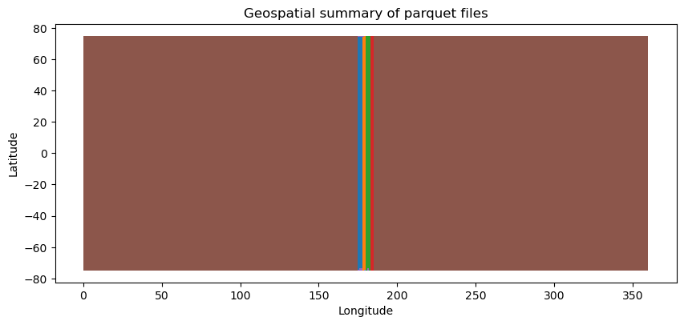
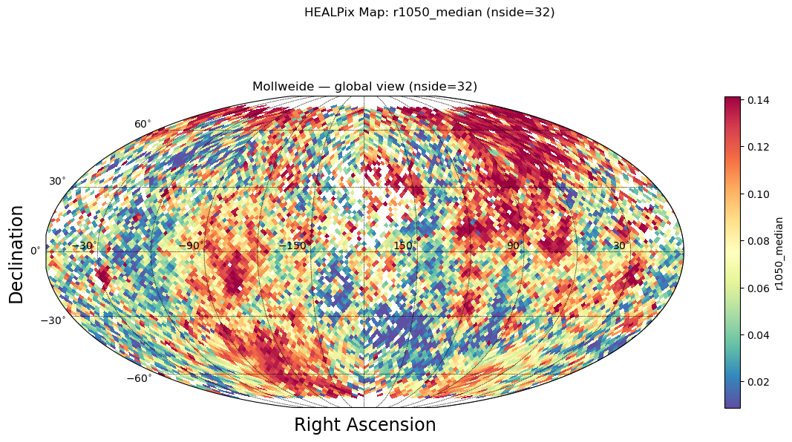

# Visualization


<!-- WARNING: THIS FILE WAS AUTOGENERATED! DO NOT EDIT! -->

## Test Data

Check available test data in the package

<details class="code-fold">
<summary>Code</summary>

``` python
from pathlib import Path

# Look for test data
test_data_dir = Path('../test_data')
if test_data_dir.exists():
    print("Test data directory found!")
    print(f"\nContents:")
    for item in sorted(test_data_dir.iterdir()):
        if item.is_file():
            size_mb = item.stat().st_size / 1024 / 1024
            print(f"  {item.name}: {size_mb:.2f} MB")
        elif item.is_dir():
            n_files = len(list(item.glob('*')))
            print(f"  {item.name}/: {n_files} files")
else:
    print("Test data directory not found. Run create_test_data.sh to generate test data.")
```

</details>

    Test data directory found!

    Contents:
      README.md: 0.00 MB
      batches/: 10 files
      derived/: 1 files
      regions/: 0 files
      samples/: 3 files
      validation/: 2 files

## Quick Test with Sample Data

If test data is available, let’s try a quick aggregation

    Loading sample: sample_50k.parquet

    Shape: (50000, 61)

    Columns: ['ref_id', 'a', 'b', 'c', 'd', 'e', 'f', 'g', 'h', 'i', 'j', 'k', 'l', 'm', 'n', 'o', 'p', 'q1', 'q2', 'q3', 'q4', 'obs_id', 'vis_slope', 'nir_slope', 'visnir_slope', 'norm_vis_slope', 'norm_nir_slope', 'norm_visnir_slope', 'curvature', 'norm_curvature', 'uv_downturn', 'color_index_310_390', 'color_index_415_750', 'color_index_750_415', 'color_index_750_950', 'r310', 'r390', 'r750', 'r950', 'r1050', 'r1400', 'r415', 'r433_2', 'r479_9', 'r556_9', 'r628_8', 'r748_7', 'r828_4', 'r898_8', 'r996_2', 'spot_number', 'lat_center', 'lon_center', 'surface', 'width', 'length', 'ang_incidence', 'ang_emission', 'ang_phase', 'azimuth', 'geometry']

    First few rows:

<div>
<style scoped>
    .dataframe tbody tr th:only-of-type {
        vertical-align: middle;
    }
&#10;    .dataframe tbody tr th {
        vertical-align: top;
    }
&#10;    .dataframe thead th {
        text-align: right;
    }
</style>

<table class="dataframe" data-quarto-postprocess="true" data-border="1">
<thead>
<tr class="header" style="text-align: right;">
<th data-quarto-table-cell-role="th"></th>
<th data-quarto-table-cell-role="th">ref_id</th>
<th data-quarto-table-cell-role="th">a</th>
<th data-quarto-table-cell-role="th">b</th>
<th data-quarto-table-cell-role="th">c</th>
<th data-quarto-table-cell-role="th">d</th>
<th data-quarto-table-cell-role="th">e</th>
<th data-quarto-table-cell-role="th">f</th>
<th data-quarto-table-cell-role="th">g</th>
<th data-quarto-table-cell-role="th">h</th>
<th data-quarto-table-cell-role="th">i</th>
<th data-quarto-table-cell-role="th">...</th>
<th data-quarto-table-cell-role="th">lat_center</th>
<th data-quarto-table-cell-role="th">lon_center</th>
<th data-quarto-table-cell-role="th">surface</th>
<th data-quarto-table-cell-role="th">width</th>
<th data-quarto-table-cell-role="th">length</th>
<th data-quarto-table-cell-role="th">ang_incidence</th>
<th data-quarto-table-cell-role="th">ang_emission</th>
<th data-quarto-table-cell-role="th">ang_phase</th>
<th data-quarto-table-cell-role="th">azimuth</th>
<th data-quarto-table-cell-role="th">geometry</th>
</tr>
</thead>
<tbody>
<tr class="odd">
<td data-quarto-table-cell-role="th">0</td>
<td>1310408274001158</td>
<td>0</td>
<td>1</td>
<td>1</td>
<td>1</td>
<td>9</td>
<td>1</td>
<td>1</td>
<td>0</td>
<td>0</td>
<td>...</td>
<td>5.186568</td>
<td>272.40450</td>
<td>1567133.40</td>
<td>1006.63727</td>
<td>1982.1799</td>
<td>43.049232</td>
<td>34.814793</td>
<td>77.85916</td>
<td>109.019295</td>
<td>b'\x01\x03\x00\x00\x00\x01\x00\x00\x00\x05\x00...</td>
</tr>
<tr class="even">
<td data-quarto-table-cell-role="th">1</td>
<td>1335313413800913</td>
<td>0</td>
<td>0</td>
<td>0</td>
<td>0</td>
<td>9</td>
<td>1</td>
<td>1</td>
<td>0</td>
<td>0</td>
<td>...</td>
<td>-60.939438</td>
<td>71.77686</td>
<td>13564574.00</td>
<td>4064.49850</td>
<td>4249.2210</td>
<td>64.178116</td>
<td>37.690910</td>
<td>101.84035</td>
<td>111.930336</td>
<td>b'\x01\x03\x00\x00\x00\x01\x00\x00\x00\x05\x00...</td>
</tr>
<tr class="odd">
<td data-quarto-table-cell-role="th">2</td>
<td>1224306405800836</td>
<td>0</td>
<td>2</td>
<td>2</td>
<td>2</td>
<td>9</td>
<td>1</td>
<td>1</td>
<td>0</td>
<td>0</td>
<td>...</td>
<td>5.613894</td>
<td>54.23045</td>
<td>1755143.50</td>
<td>1013.51886</td>
<td>2204.9104</td>
<td>53.815990</td>
<td>24.053764</td>
<td>77.86254</td>
<td>99.559425</td>
<td>b'\x01\x03\x00\x00\x00\x01\x00\x00\x00\x05\x00...</td>
</tr>
<tr class="even">
<td data-quarto-table-cell-role="th">3</td>
<td>1421301274400732</td>
<td>0</td>
<td>1</td>
<td>1</td>
<td>1</td>
<td>9</td>
<td>1</td>
<td>1</td>
<td>0</td>
<td>0</td>
<td>...</td>
<td>-41.672714</td>
<td>324.49740</td>
<td>23309360.00</td>
<td>6511.20950</td>
<td>4558.0470</td>
<td>52.841824</td>
<td>46.625698</td>
<td>99.40995</td>
<td>121.833626</td>
<td>b'\x01\x03\x00\x00\x00\x01\x00\x00\x00\x05\x00...</td>
</tr>
<tr class="odd">
<td data-quarto-table-cell-role="th">4</td>
<td>1310308273500668</td>
<td>0</td>
<td>0</td>
<td>0</td>
<td>0</td>
<td>9</td>
<td>1</td>
<td>1</td>
<td>0</td>
<td>0</td>
<td>...</td>
<td>26.975400</td>
<td>284.81708</td>
<td>905292.56</td>
<td>480.38028</td>
<td>2399.4622</td>
<td>56.780300</td>
<td>21.083624</td>
<td>77.85945</td>
<td>97.433360</td>
<td>b'\x01\x03\x00\x00\x00\x01\x00\x00\x00\x05\x00...</td>
</tr>
</tbody>
</table>

<p>5 rows × 61 columns</p>
</div>
<div>
<style scoped>
    .dataframe tbody tr th:only-of-type {
        vertical-align: middle;
    }
&#10;    .dataframe tbody tr th {
        vertical-align: top;
    }
&#10;    .dataframe thead th {
        text-align: right;
    }
</style>

<table class="dataframe" data-quarto-postprocess="true" data-border="1">
<thead>
<tr class="header" style="text-align: right;">
<th data-quarto-table-cell-role="th"></th>
<th data-quarto-table-cell-role="th">file</th>
<th data-quarto-table-cell-role="th">size_mb</th>
<th data-quarto-table-cell-role="th">n_rows</th>
<th data-quarto-table-cell-role="th">lat_min</th>
<th data-quarto-table-cell-role="th">lat_max</th>
<th data-quarto-table-cell-role="th">lon_min</th>
<th data-quarto-table-cell-role="th">lon_max</th>
<th data-quarto-table-cell-role="th">filename</th>
</tr>
</thead>
<tbody>
<tr class="odd">
<td data-quarto-table-cell-role="th">0</td>
<td>samples/sample_50k.parquet</td>
<td>18.891136</td>
<td>50000</td>
<td>-74.986440</td>
<td>74.946884</td>
<td>0.020273</td>
<td>359.96555</td>
<td>sample_50k</td>
</tr>
<tr class="even">
<td data-quarto-table-cell-role="th">1</td>
<td>samples/sample_5k.parquet</td>
<td>1.941895</td>
<td>5000</td>
<td>-74.954390</td>
<td>74.846540</td>
<td>0.274960</td>
<td>359.80890</td>
<td>sample_5k</td>
</tr>
<tr class="odd">
<td data-quarto-table-cell-role="th">2</td>
<td>samples/sample_25k.parquet</td>
<td>9.614980</td>
<td>25000</td>
<td>-74.934560</td>
<td>74.767715</td>
<td>0.057941</td>
<td>359.97324</td>
<td>sample_25k</td>
</tr>
<tr class="even">
<td data-quarto-table-cell-role="th">3</td>
<td>derived/cli_quickstart/sample_50k-aggregated-d...</td>
<td>2.431089</td>
<td>49152</td>
<td>NaN</td>
<td>NaN</td>
<td>NaN</td>
<td>NaN</td>
<td>sample_50k-aggregated-densified.cell-healpix_a...</td>
</tr>
<tr class="odd">
<td data-quarto-table-cell-role="th">4</td>
<td>derived/cli_quickstart/sample_50k-aggregated.c...</td>
<td>0.806005</td>
<td>10860</td>
<td>NaN</td>
<td>NaN</td>
<td>NaN</td>
<td>NaN</td>
<td>sample_50k-aggregated.cell-healpix_assignment-...</td>
</tr>
<tr class="even">
<td data-quarto-table-cell-role="th">5</td>
<td>derived/cli_quickstart/sample_50k.cell-healpix...</td>
<td>0.430335</td>
<td>54931</td>
<td>NaN</td>
<td>NaN</td>
<td>NaN</td>
<td>NaN</td>
<td>sample_50k.cell-healpix_assignment-fuzzy_nside...</td>
</tr>
<tr class="odd">
<td data-quarto-table-cell-role="th">6</td>
<td>derived/cli_quickstart/sample_50k-aggregated.c...</td>
<td>0.538363</td>
<td>10860</td>
<td>NaN</td>
<td>NaN</td>
<td>NaN</td>
<td>NaN</td>
<td>sample_50k-aggregated.cell-healpix_assignment-...</td>
</tr>
<tr class="even">
<td data-quarto-table-cell-role="th">7</td>
<td>derived/cli_quickstart/sample_50k-aggregated-d...</td>
<td>0.552613</td>
<td>12288</td>
<td>NaN</td>
<td>NaN</td>
<td>NaN</td>
<td>NaN</td>
<td>sample_50k-aggregated-densified.cell-healpix_a...</td>
</tr>
<tr class="odd">
<td data-quarto-table-cell-role="th">8</td>
<td>derived/cli_quickstart/sample_50k-aggregated-d...</td>
<td>0.850032</td>
<td>12288</td>
<td>NaN</td>
<td>NaN</td>
<td>NaN</td>
<td>NaN</td>
<td>sample_50k-aggregated-densified.cell-healpix_a...</td>
</tr>
<tr class="even">
<td data-quarto-table-cell-role="th">9</td>
<td>derived/cli_quickstart/sample_50k-aggregated.c...</td>
<td>1.134424</td>
<td>27990</td>
<td>NaN</td>
<td>NaN</td>
<td>NaN</td>
<td>NaN</td>
<td>sample_50k-aggregated.cell-healpix_assignment-...</td>
</tr>
<tr class="odd">
<td data-quarto-table-cell-role="th">10</td>
<td>derived/cli_quickstart/sample_50k.cell-healpix...</td>
<td>0.525922</td>
<td>59592</td>
<td>NaN</td>
<td>NaN</td>
<td>NaN</td>
<td>NaN</td>
<td>sample_50k.cell-healpix_assignment-fuzzy_nside...</td>
</tr>
<tr class="even">
<td data-quarto-table-cell-role="th">11</td>
<td>derived/cli_quickstart/sample_50k-aggregated.c...</td>
<td>1.828314</td>
<td>27990</td>
<td>NaN</td>
<td>NaN</td>
<td>NaN</td>
<td>NaN</td>
<td>sample_50k-aggregated.cell-healpix_assignment-...</td>
</tr>
<tr class="odd">
<td data-quarto-table-cell-role="th">12</td>
<td>derived/cli_quickstart/sample_50k-aggregated-d...</td>
<td>1.302203</td>
<td>49152</td>
<td>NaN</td>
<td>NaN</td>
<td>NaN</td>
<td>NaN</td>
<td>sample_50k-aggregated-densified.cell-healpix_a...</td>
</tr>
<tr class="even">
<td data-quarto-table-cell-role="th">13</td>
<td>validation/high_quality_subset.parquet</td>
<td>9.039313</td>
<td>25121</td>
<td>-74.992330</td>
<td>74.683150</td>
<td>175.000180</td>
<td>184.99979</td>
<td>high_quality_subset</td>
</tr>
<tr class="odd">
<td data-quarto-table-cell-role="th">14</td>
<td>validation/combined_batch_001_003.parquet</td>
<td>3.963343</td>
<td>10890</td>
<td>-74.627014</td>
<td>74.447170</td>
<td>175.000180</td>
<td>177.99991</td>
<td>combined_batch_001_003</td>
</tr>
<tr class="even">
<td data-quarto-table-cell-role="th">15</td>
<td>batches/batch_009.parquet</td>
<td>1.613665</td>
<td>4417</td>
<td>-74.822310</td>
<td>74.647300</td>
<td>183.000080</td>
<td>183.99973</td>
<td>batch_009</td>
</tr>
<tr class="odd">
<td data-quarto-table-cell-role="th">16</td>
<td>batches/batch_003.parquet</td>
<td>1.373512</td>
<td>3734</td>
<td>-73.450960</td>
<td>74.447170</td>
<td>177.000500</td>
<td>177.99991</td>
<td>batch_003</td>
</tr>
<tr class="even">
<td data-quarto-table-cell-role="th">17</td>
<td>batches/batch_007.parquet</td>
<td>1.530362</td>
<td>4174</td>
<td>-73.332790</td>
<td>74.656006</td>
<td>181.000610</td>
<td>181.99995</td>
<td>batch_007</td>
</tr>
<tr class="odd">
<td data-quarto-table-cell-role="th">18</td>
<td>batches/batch_010.parquet</td>
<td>1.799953</td>
<td>4931</td>
<td>-74.797844</td>
<td>74.683150</td>
<td>184.000270</td>
<td>184.99979</td>
<td>batch_010</td>
</tr>
<tr class="even">
<td data-quarto-table-cell-role="th">19</td>
<td>batches/batch_004.parquet</td>
<td>1.463505</td>
<td>3990</td>
<td>-74.927130</td>
<td>74.425640</td>
<td>178.000030</td>
<td>178.99997</td>
<td>batch_004</td>
</tr>
<tr class="odd">
<td data-quarto-table-cell-role="th">20</td>
<td>batches/batch_006.parquet</td>
<td>1.424916</td>
<td>3885</td>
<td>-74.992330</td>
<td>74.492300</td>
<td>180.000020</td>
<td>180.99980</td>
<td>batch_006</td>
</tr>
<tr class="even">
<td data-quarto-table-cell-role="th">21</td>
<td>batches/batch_008.parquet</td>
<td>1.635924</td>
<td>4482</td>
<td>-74.920740</td>
<td>74.619770</td>
<td>182.000020</td>
<td>182.99991</td>
<td>batch_008</td>
</tr>
<tr class="odd">
<td data-quarto-table-cell-role="th">22</td>
<td>batches/batch_001.parquet</td>
<td>1.117513</td>
<td>3029</td>
<td>-74.627014</td>
<td>74.381710</td>
<td>175.000180</td>
<td>175.99908</td>
<td>batch_001</td>
</tr>
<tr class="even">
<td data-quarto-table-cell-role="th">23</td>
<td>batches/batch_005.parquet</td>
<td>1.655387</td>
<td>4502</td>
<td>-74.632195</td>
<td>74.596970</td>
<td>179.000470</td>
<td>179.99990</td>
<td>batch_005</td>
</tr>
<tr class="odd">
<td data-quarto-table-cell-role="th">24</td>
<td>batches/batch_002.parquet</td>
<td>1.513108</td>
<td>4127</td>
<td>-73.357796</td>
<td>74.422920</td>
<td>176.000030</td>
<td>176.99920</td>
<td>batch_002</td>
</tr>
</tbody>
</table>

</div>

Those are the boundaries used to sample the initial data



``` python
# #| hide
# # convert to geopandas creating a polygon box with lat_min    lat_max lon_min lon_max per file
# ax = gdf_stats[~gdf_stats.filename.str.contains('sample')].plot(column='filename', legend=False, figsize=(20, 6), aspect=0.25)
# ax.set_xlim([150, 200])
# ax.set_xlabel('Longitude')
# ax.set_ylabel('Latitude')
# ax.set_title('Geospatial coverage of parquet files (excluding sample files)')
```

## Create Sidecar for Sample Data

Now let’s create a HEALPix sidecar for the sample data. We can do this
in memory without writing to a file.

<details class="code-fold">
<summary>Code</summary>

``` python
# Load the 50k sample
import geopandas as gpd
from shapely import wkb

sample_file = test_data_dir / 'samples' / 'sample_50k.parquet'
print(f"Loading: {sample_file}")

# Read as regular pandas DataFrame first (geometry is stored as WKB binary)
df = pd.read_parquet(sample_file)
print(f"Loaded {len(df)} rows")
print(f"Columns: {list(df.columns)}")

# Convert WKB geometry column to shapely geometries
if 'geometry' in df.columns:
    print("\nConverting WKB geometry to GeoDataFrame...")
    df['geometry'] = df['geometry'].apply(lambda x: wkb.loads(bytes(x)) if x is not None else None)
    gdf = gpd.GeoDataFrame(df, geometry='geometry', crs='EPSG:4326')
    print(f"CRS: {gdf.crs}")
else:
    print("\nNo geometry column found!")
    gdf = df

# Show first few rows
gdf.head(3).iloc[:,-10:]
```

</details>

    Loading: ../test_data/samples/sample_50k.parquet
    Loaded 50000 rows
    Columns: ['ref_id', 'a', 'b', 'c', 'd', 'e', 'f', 'g', 'h', 'i', 'j', 'k', 'l', 'm', 'n', 'o', 'p', 'q1', 'q2', 'q3', 'q4', 'obs_id', 'vis_slope', 'nir_slope', 'visnir_slope', 'norm_vis_slope', 'norm_nir_slope', 'norm_visnir_slope', 'curvature', 'norm_curvature', 'uv_downturn', 'color_index_310_390', 'color_index_415_750', 'color_index_750_415', 'color_index_750_950', 'r310', 'r390', 'r750', 'r950', 'r1050', 'r1400', 'r415', 'r433_2', 'r479_9', 'r556_9', 'r628_8', 'r748_7', 'r828_4', 'r898_8', 'r996_2', 'spot_number', 'lat_center', 'lon_center', 'surface', 'width', 'length', 'ang_incidence', 'ang_emission', 'ang_phase', 'azimuth', 'geometry']

    Converting WKB geometry to GeoDataFrame...
    CRS: EPSG:4326

<div>
<style scoped>
    .dataframe tbody tr th:only-of-type {
        vertical-align: middle;
    }
&#10;    .dataframe tbody tr th {
        vertical-align: top;
    }
&#10;    .dataframe thead th {
        text-align: right;
    }
</style>

<table class="dataframe" data-quarto-postprocess="true" data-border="1">
<thead>
<tr class="header" style="text-align: right;">
<th data-quarto-table-cell-role="th"></th>
<th data-quarto-table-cell-role="th">lat_center</th>
<th data-quarto-table-cell-role="th">lon_center</th>
<th data-quarto-table-cell-role="th">surface</th>
<th data-quarto-table-cell-role="th">width</th>
<th data-quarto-table-cell-role="th">length</th>
<th data-quarto-table-cell-role="th">ang_incidence</th>
<th data-quarto-table-cell-role="th">ang_emission</th>
<th data-quarto-table-cell-role="th">ang_phase</th>
<th data-quarto-table-cell-role="th">azimuth</th>
<th data-quarto-table-cell-role="th">geometry</th>
</tr>
</thead>
<tbody>
<tr class="odd">
<td data-quarto-table-cell-role="th">0</td>
<td>5.186568</td>
<td>272.40450</td>
<td>1567133.4</td>
<td>1006.63727</td>
<td>1982.1799</td>
<td>43.049232</td>
<td>34.814793</td>
<td>77.85916</td>
<td>109.019295</td>
<td>POLYGON ((272.39758 5.16433, 272.41583 5.18307...</td>
</tr>
<tr class="even">
<td data-quarto-table-cell-role="th">1</td>
<td>-60.939438</td>
<td>71.77686</td>
<td>13564574.0</td>
<td>4064.49850</td>
<td>4249.2210</td>
<td>64.178116</td>
<td>37.690910</td>
<td>101.84035</td>
<td>111.930336</td>
<td>POLYGON ((71.72596 -60.89612, 71.69186 -60.963...</td>
</tr>
<tr class="odd">
<td data-quarto-table-cell-role="th">2</td>
<td>5.613894</td>
<td>54.23045</td>
<td>1755143.5</td>
<td>1013.51886</td>
<td>2204.9104</td>
<td>53.815990</td>
<td>24.053764</td>
<td>77.86254</td>
<td>99.559425</td>
<td>POLYGON ((54.24406 5.63592, 54.22025 5.62014, ...</td>
</tr>
</tbody>
</table>

</div>

Create sidecar in memory using the process_partition function

<details class="code-fold">
<summary>Code</summary>

``` python
# Create sidecar in memory using the process_partition function
from healpyxel.sidecar import process_partition

# Parameters
nside = 32  # HEALPix resolution
mode = 'fuzzy'  # 'fuzzy' allows multiple cells per geometry, 'strict' only single-cell geometries

# Process the GeoDataFrame
sidecar_df = process_partition(
    gdf=gdf,
    nside=nside,
    mode=mode,
    base_index=0,  # Start source_id from 0
    lon_convention='0_360',  # Use '0_360' or '-180_180' (underscores, not hyphens!)
)

print(f"Created sidecar with {len(sidecar_df)} assignments")
print(f"Unique geometries: {sidecar_df['source_id'].nunique()}")
print(f"Unique HEALPix cells: {sidecar_df['healpix_id'].nunique()}")
print(f"\nSidecar columns: {list(sidecar_df.columns)}")
print(f"Sidecar dtypes:\n{sidecar_df.dtypes}")

# Show first few assignments
sidecar_df.head(10)
```

</details>

    2026-02-05 17:06:31,997 INFO Partition (lon_convention=0_360): processed 50000 geometries, dropped 12 (0.0%) total [pre-filter: 12, post-processing: 0]

    Created sidecar with 54931 assignments
    Unique geometries: 49988
    Unique HEALPix cells: 10860

    Sidecar columns: ['source_id', 'healpix_id', 'weight']
    Sidecar dtypes:
    source_id       int64
    healpix_id     UInt64
    weight        float64
    dtype: object

<div>
<style scoped>
    .dataframe tbody tr th:only-of-type {
        vertical-align: middle;
    }
&#10;    .dataframe tbody tr th {
        vertical-align: top;
    }
&#10;    .dataframe thead th {
        text-align: right;
    }
</style>

<table class="dataframe" data-quarto-postprocess="true" data-border="1">
<thead>
<tr class="header" style="text-align: right;">
<th data-quarto-table-cell-role="th"></th>
<th data-quarto-table-cell-role="th">source_id</th>
<th data-quarto-table-cell-role="th">healpix_id</th>
<th data-quarto-table-cell-role="th">weight</th>
</tr>
</thead>
<tbody>
<tr class="odd">
<td data-quarto-table-cell-role="th">0</td>
<td>0</td>
<td>7943</td>
<td>1.0</td>
</tr>
<tr class="even">
<td data-quarto-table-cell-role="th">1</td>
<td>1</td>
<td>8287</td>
<td>1.0</td>
</tr>
<tr class="odd">
<td data-quarto-table-cell-role="th">2</td>
<td>2</td>
<td>5819</td>
<td>1.0</td>
</tr>
<tr class="even">
<td data-quarto-table-cell-role="th">3</td>
<td>3</td>
<td>11685</td>
<td>1.0</td>
</tr>
<tr class="odd">
<td data-quarto-table-cell-role="th">4</td>
<td>4</td>
<td>3618</td>
<td>1.0</td>
</tr>
<tr class="even">
<td data-quarto-table-cell-role="th">5</td>
<td>5</td>
<td>3805</td>
<td>1.0</td>
</tr>
<tr class="odd">
<td data-quarto-table-cell-role="th">6</td>
<td>6</td>
<td>9522</td>
<td>1.0</td>
</tr>
<tr class="even">
<td data-quarto-table-cell-role="th">7</td>
<td>7</td>
<td>10975</td>
<td>1.0</td>
</tr>
<tr class="odd">
<td data-quarto-table-cell-role="th">8</td>
<td>8</td>
<td>1820</td>
<td>1.0</td>
</tr>
<tr class="even">
<td data-quarto-table-cell-role="th">9</td>
<td>9</td>
<td>3710</td>
<td>1.0</td>
</tr>
</tbody>
</table>

</div>

Check how many cells each geometry touches (for fuzzy mode)

    Assignment statistics:
      Min cells per geometry: 1
      Max cells per geometry: 4
      Mean cells per geometry: 1.10
      Median cells per geometry: 1

    Distribution of assignments per geometry:
    1    45331
    2     4396
    3      236
    4       25
    Name: count, dtype: int64

Optional: Save sidecar to file for later use

<details class="code-fold">
<summary>Code</summary>

``` python
sidecar_output = pathlib.Path(f'/tmp/sample_50k_sidecar_nside{nside}_{mode}.parquet')
sidecar_df.to_parquet(sidecar_output, index=False)
print(f"Saved sidecar to: {sidecar_output}")
print(f"File size: {sidecar_output.stat().st_size / 1024:.2f} KB")
```

</details>

    Saved sidecar to: /tmp/sample_50k_sidecar_nside32_fuzzy.parquet
    File size: 441.63 KB

## Aggregate Data by HEALPix Cells

Now let’s use the sidecar to aggregate the `r1050` column from the
original data by HEALPix cells.

    ✓ Column 'r1050' found in the data
      Range: [-0.050, 0.325]
      Missing values: 0 / 50000

Aggregate r1050 by HEALPix cells with explicit aggregation functions.

Convert GeoDataFrame to regular DataFrame for aggregation (geometry not
needed)/

    2026-02-05 17:06:32,336 INFO Creating source_id column from DataFrame index
    2026-02-05 17:06:32,366 INFO Sidecar source_id overlap: 49988/49988 (100.0%)
    2026-02-05 17:06:32,366 INFO Merging sidecar with original data
    2026-02-05 17:06:32,371 INFO Grouping by healpix_id and computing aggregations
    2026-02-05 17:06:32,437 INFO Processing 10860 HEALPix cells
    2026-02-05 17:06:35,115 INFO Aggregation complete: 10860 cells with data

    Aggregating HEALPix cells:   0%|          | 0/10860 [00:00<?, ?cell/s]

    Aggregated data shape: (10860, 6)
    Number of HEALPix cells with data: 10860

    Aggregated columns: ['r1050_mean', 'r1050_median', 'r1050_std', 'r1050_mad', 'r1050_robust_std', 'n_sources']

<div>
<style scoped>
    .dataframe tbody tr th:only-of-type {
        vertical-align: middle;
    }
&#10;    .dataframe tbody tr th {
        vertical-align: top;
    }
&#10;    .dataframe thead th {
        text-align: right;
    }
</style>

<table class="dataframe" data-quarto-postprocess="true" data-border="1">
<thead>
<tr class="header" style="text-align: right;">
<th data-quarto-table-cell-role="th"></th>
<th data-quarto-table-cell-role="th">r1050_mean</th>
<th data-quarto-table-cell-role="th">r1050_median</th>
<th data-quarto-table-cell-role="th">r1050_std</th>
<th data-quarto-table-cell-role="th">r1050_mad</th>
<th data-quarto-table-cell-role="th">r1050_robust_std</th>
<th data-quarto-table-cell-role="th">n_sources</th>
</tr>
<tr class="odd">
<th data-quarto-table-cell-role="th">healpix_id</th>
<th data-quarto-table-cell-role="th"></th>
<th data-quarto-table-cell-role="th"></th>
<th data-quarto-table-cell-role="th"></th>
<th data-quarto-table-cell-role="th"></th>
<th data-quarto-table-cell-role="th"></th>
<th data-quarto-table-cell-role="th"></th>
</tr>
</thead>
<tbody>
<tr class="odd">
<td data-quarto-table-cell-role="th">0</td>
<td>0.048616</td>
<td>0.047857</td>
<td>0.003759</td>
<td>0.002672</td>
<td>0.003962</td>
<td>4</td>
</tr>
<tr class="even">
<td data-quarto-table-cell-role="th">1</td>
<td>0.051467</td>
<td>0.052283</td>
<td>0.002976</td>
<td>0.001888</td>
<td>0.002799</td>
<td>6</td>
</tr>
<tr class="odd">
<td data-quarto-table-cell-role="th">2</td>
<td>0.049697</td>
<td>0.049118</td>
<td>0.003637</td>
<td>0.002289</td>
<td>0.003394</td>
<td>6</td>
</tr>
<tr class="even">
<td data-quarto-table-cell-role="th">3</td>
<td>0.059066</td>
<td>0.063241</td>
<td>0.007149</td>
<td>0.001711</td>
<td>0.002537</td>
<td>3</td>
</tr>
<tr class="odd">
<td data-quarto-table-cell-role="th">4</td>
<td>0.051262</td>
<td>0.051523</td>
<td>0.006552</td>
<td>0.002510</td>
<td>0.003721</td>
<td>9</td>
</tr>
<tr class="even">
<td data-quarto-table-cell-role="th">5</td>
<td>0.047092</td>
<td>0.047639</td>
<td>0.008176</td>
<td>0.003183</td>
<td>0.004719</td>
<td>7</td>
</tr>
<tr class="odd">
<td data-quarto-table-cell-role="th">6</td>
<td>0.058219</td>
<td>0.058195</td>
<td>0.002682</td>
<td>0.002040</td>
<td>0.003024</td>
<td>6</td>
</tr>
<tr class="even">
<td data-quarto-table-cell-role="th">7</td>
<td>0.053656</td>
<td>0.054208</td>
<td>0.008577</td>
<td>0.006288</td>
<td>0.009323</td>
<td>8</td>
</tr>
<tr class="odd">
<td data-quarto-table-cell-role="th">8</td>
<td>0.037711</td>
<td>0.037711</td>
<td>0.008823</td>
<td>0.008823</td>
<td>0.013080</td>
<td>2</td>
</tr>
<tr class="even">
<td data-quarto-table-cell-role="th">9</td>
<td>0.041094</td>
<td>0.041094</td>
<td>0.012205</td>
<td>0.012205</td>
<td>0.018096</td>
<td>2</td>
</tr>
</tbody>
</table>

</div>

### Interpret the Results

Each row represents one HEALPix cell with: - `healpix_id`: The HEALPix
cell identifier - `r1050_mean`: Mean of r1050 values in this cell -
`r1050_median`: Median value (less affected by outliers) - `r1050_std`:
Standard deviation (spread of values) - `r1050_mad`: Median Absolute
Deviation (robust measure of spread) - `r1050_robust_std`: MAD \* 1.4826
(approximates standard deviation for normal distributions) -
`n_sources`: Number of source measurements in this cell, for all columns

Let’s examine the statistics of the aggregated data.

first, Display summary statistics of the aggregated results on HEALPix
cells:

Check the distribution of source counts per HEALPix cell:


    Cells with only 1 source: 1644
    Cells with 2-5 sources: 5696
    Cells with 5+ sources: 3520

<div>
<style scoped>
    .dataframe tbody tr th:only-of-type {
        vertical-align: middle;
    }
&#10;    .dataframe tbody tr th {
        vertical-align: top;
    }
&#10;    .dataframe thead th {
        text-align: right;
    }
</style>

<table class="dataframe" data-quarto-postprocess="true" data-border="1">
<thead>
<tr class="header" style="text-align: right;">
<th data-quarto-table-cell-role="th"></th>
<th data-quarto-table-cell-role="th">n_sources</th>
</tr>
</thead>
<tbody>
<tr class="odd">
<td data-quarto-table-cell-role="th">count</td>
<td>10860.000000</td>
</tr>
<tr class="even">
<td data-quarto-table-cell-role="th">mean</td>
<td>5.058103</td>
</tr>
<tr class="odd">
<td data-quarto-table-cell-role="th">std</td>
<td>4.835600</td>
</tr>
<tr class="even">
<td data-quarto-table-cell-role="th">min</td>
<td>1.000000</td>
</tr>
<tr class="odd">
<td data-quarto-table-cell-role="th">25%</td>
<td>2.000000</td>
</tr>
<tr class="even">
<td data-quarto-table-cell-role="th">50%</td>
<td>4.000000</td>
</tr>
<tr class="odd">
<td data-quarto-table-cell-role="th">75%</td>
<td>6.000000</td>
</tr>
<tr class="even">
<td data-quarto-table-cell-role="th">max</td>
<td>98.000000</td>
</tr>
</tbody>
</table>

</div>

### HEALPix Metadata

The aggregation results don’t automatically include HEALPix metadata.
You need to track this separately or read it from a saved sidecar file.
For in-memory workflows, store metadata explicitly:

    HEALPix Configuration:
      nside: 32
      order: nested
      nested: True
      mode: fuzzy

**Reading metadata from saved sidecar files:**

If you save the sidecar to a parquet file (like we did earlier), the
metadata is embedded in the parquet schema and can be read back.

Read metadata from saved sidecar file:

    Metadata from saved sidecar file:
      nside: N/A
      mode: N/A
      order: N/A

## Visualize HEALPix Map

Before visualizing, we need to densify the sparse aggregated data to
include all HEALPix cells (including empty ones).

We’ll use the visualization utilities from `healpyxel.visualization`
module.

The aggregated DataFrame only contains cells with data (sparse).

Densify to create a full HEALPix grid with all npix = 12 \* nside^2
cells

    2026-02-05 17:06:35,263 INFO Densified from 10860 to 12288 cells (nside=32)

    Sparse aggregated cells: 10860
    Dense HEALPix grid cells: 12288 (expected: 12288)

    Empty cells (no data): 1428
    Cells with data: 10860

<div>
<style scoped>
    .dataframe tbody tr th:only-of-type {
        vertical-align: middle;
    }
&#10;    .dataframe tbody tr th {
        vertical-align: top;
    }
&#10;    .dataframe thead th {
        text-align: right;
    }
</style>

<table class="dataframe" data-quarto-postprocess="true" data-border="1">
<thead>
<tr class="header" style="text-align: right;">
<th data-quarto-table-cell-role="th"></th>
<th data-quarto-table-cell-role="th">r1050_mean</th>
<th data-quarto-table-cell-role="th">r1050_median</th>
<th data-quarto-table-cell-role="th">r1050_std</th>
<th data-quarto-table-cell-role="th">r1050_mad</th>
<th data-quarto-table-cell-role="th">r1050_robust_std</th>
<th data-quarto-table-cell-role="th">n_sources</th>
</tr>
<tr class="odd">
<th data-quarto-table-cell-role="th">healpix_id</th>
<th data-quarto-table-cell-role="th"></th>
<th data-quarto-table-cell-role="th"></th>
<th data-quarto-table-cell-role="th"></th>
<th data-quarto-table-cell-role="th"></th>
<th data-quarto-table-cell-role="th"></th>
<th data-quarto-table-cell-role="th"></th>
</tr>
</thead>
<tbody>
<tr class="odd">
<td data-quarto-table-cell-role="th">0</td>
<td>0.048616</td>
<td>0.047857</td>
<td>0.003759</td>
<td>0.002672</td>
<td>0.003962</td>
<td>4.0</td>
</tr>
<tr class="even">
<td data-quarto-table-cell-role="th">1</td>
<td>0.051467</td>
<td>0.052283</td>
<td>0.002976</td>
<td>0.001888</td>
<td>0.002799</td>
<td>6.0</td>
</tr>
<tr class="odd">
<td data-quarto-table-cell-role="th">2</td>
<td>0.049697</td>
<td>0.049118</td>
<td>0.003637</td>
<td>0.002289</td>
<td>0.003394</td>
<td>6.0</td>
</tr>
<tr class="even">
<td data-quarto-table-cell-role="th">3</td>
<td>0.059066</td>
<td>0.063241</td>
<td>0.007149</td>
<td>0.001711</td>
<td>0.002537</td>
<td>3.0</td>
</tr>
<tr class="odd">
<td data-quarto-table-cell-role="th">4</td>
<td>0.051262</td>
<td>0.051523</td>
<td>0.006552</td>
<td>0.002510</td>
<td>0.003721</td>
<td>9.0</td>
</tr>
<tr class="even">
<td data-quarto-table-cell-role="th">5</td>
<td>0.047092</td>
<td>0.047639</td>
<td>0.008176</td>
<td>0.003183</td>
<td>0.004719</td>
<td>7.0</td>
</tr>
<tr class="odd">
<td data-quarto-table-cell-role="th">6</td>
<td>0.058219</td>
<td>0.058195</td>
<td>0.002682</td>
<td>0.002040</td>
<td>0.003024</td>
<td>6.0</td>
</tr>
<tr class="even">
<td data-quarto-table-cell-role="th">7</td>
<td>0.053656</td>
<td>0.054208</td>
<td>0.008577</td>
<td>0.006288</td>
<td>0.009323</td>
<td>8.0</td>
</tr>
<tr class="odd">
<td data-quarto-table-cell-role="th">8</td>
<td>0.037711</td>
<td>0.037711</td>
<td>0.008823</td>
<td>0.008823</td>
<td>0.013080</td>
<td>2.0</td>
</tr>
<tr class="even">
<td data-quarto-table-cell-role="th">9</td>
<td>0.041094</td>
<td>0.041094</td>
<td>0.012205</td>
<td>0.012205</td>
<td>0.018096</td>
<td>2.0</td>
</tr>
</tbody>
</table>

</div>

Import visualization utilities from healpyxel and prepare the HEALPix
map for visualization

<details class="code-fold">
<summary>Code</summary>

``` python
# Import visualization utilities from healpyxel
from healpyxel.visualization import prepare_healpix_map
import numpy as np

# Prepare the HEALPix map for visualization
output_column = 'r1050_median'

healpix_map, valid_pixels, invalid_pixels, mappable = prepare_healpix_map(
    aggregated_dense,
    output_column=output_column,
    equalize=True,  # Apply histogram equalization for better contrast
    percentile_cutoff=None,  # Optional: clip outliers, e.g., 5 for [5%, 95%]
    cmap='Spectral_r'
)

print(f"HEALPix map prepared:")
print(f"  Total pixels: {len(healpix_map)}")
print(f"  Valid pixels: {valid_pixels.sum()}")
print(f"  Invalid pixels: {invalid_pixels.sum()}")
```

</details>

    HEALPix map prepared:
      Total pixels: 12288
      Valid pixels: 10860
      Invalid pixels: 1428


