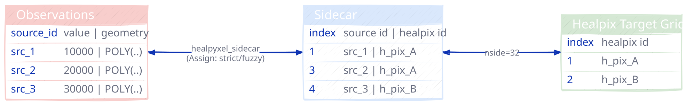
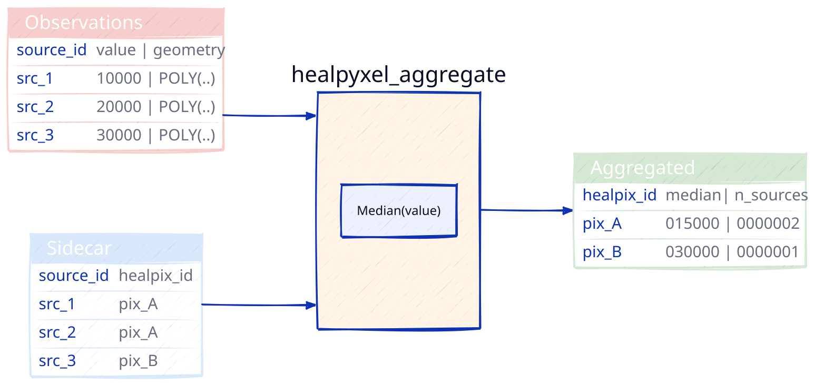
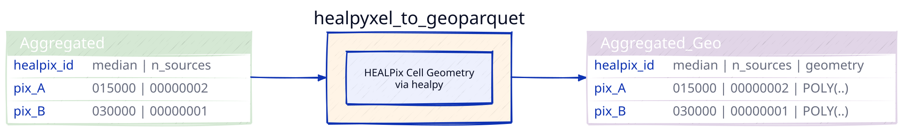
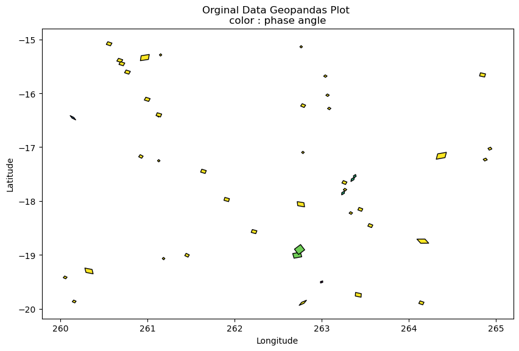

# healpyxel


<!-- WARNING: THIS FILE WAS AUTOGENERATED! DO NOT EDIT! -->

## What is HEALPix?

**HEALPix** (Hierarchical Equal Area isoLatitude Pixelization) is a
standard for partitioning a sphere (like a planet or the sky) into
pixels of equal surface area.

Unlike traditional “rectangular” map projections (like Equirectangular
or Mercator), HEALPix ensures that:

- **Every pixel is the same size:** Statistical analysis remains valid
  across the entire globe, including the poles.
- **It is Hierarchical:** You can easily increase or decrease resolution
  (*N**S**I**D**E*) while maintaining spatial relationships.
- **Fast Computation:** Its structure allows for extremely efficient
  neighbor searches and spherical harmonic transforms.

Some useful links:

- [HEALPix - Wikipedia](https://en.wikipedia.org/wiki/HEALPix)
- LandscapeGeoinformatics/[Awesome Discrete Global Grid Systems
  (DGGS)](https://github.com/LandscapeGeoinformatics/awesome-discrete-global-grid-systems?tab=readme-ov-file)
- pangeo-data/[awesome-HEALPix](https://github.com/pangeo-data/awesome-HEALPix):
  A curated list of awesome HEALPix libraries, tools, and resources.

## The Problem: Data Distortion & Scale

In planetary science, data often arrives as **scattered points, tracks,
or footprints** from spectrometers and altimeters. Traditionally,
researchers face two major hurdles:

1.  **Projection Bias:** Standard grids distort the poles, making global
    surface calculations (like mean chemical abundance or crater
    density) mathematically biased.
2.  **The Memory Wall:** Modern missions generate billions of points.
    Loading an entire global high-resolution map into RAM to update it
    is often impossible.

`healpyxel` solves this by treating the sphere as a **modern data
engineering target** rather than just a geometric grid.

## Design Philosophy & Use Cases

`healpyxel` is built on the **Unix Philosophy**: do one thing and do it
well, using a decoupled, chainable structure. It treats HEALPix indexing
as a data-engineering problem rather than just a geometric one.

This package relies heavily on
[healpy](https://healpy.readthedocs.io/en/latest/).

astropy also have a contributed module to handle those grids called
[astropy_healpix](https://astropy-healpix.readthedocs.io/en/latest/).

### Who is this for?

This package is ideal for researchers and data engineers working with
**sparse, irregular, or streaming planetary and astronomical datasets.**

- **Remote Sensing & Planetary Science:** Specifically designed for
  instruments like 1-point spectrometers (e.g., MESSENGER/MASCS), laser
  altimeters, and push-broom spectrometers.
- **The “Sidecar” Workflow:** Index your data without modifying the
  original source files. `healpyxel` creates lightweight “sidecar” files
  that map your GeoParquet rows to HEALPix cells.
- **Large-Scale Data Engineering:** Process TB-scale datasets using a
  **Split-Apply-Combine** approach on GeoParquet.
- **Streaming & Incremental Ingestion:** Update global maps as new data
  arrives without reprocessing the entire historical archive.

### <span style="color: red;">🛑 Who is this NOT for?</span>

You might consider alternatives if your use case falls into these
categories:

- **High-Resolution 2D Imagery:** For dense image-to-HEALPix
  re-projection (e.g., CCD frames), tools like
  [reproject](https://reproject.readthedocs.io/) or
  [astropy-healpix](https://astropy-healpix.readthedocs.io/) are more
  suitable.
- **Standard Xarray/Dask Unstructured Grids:** For deep integration with
  general unstructured meshes beyond HEALPix, use
  [UXarray](https://uxarray.readthedocs.io/).
- **Multi-order Coverage (MOC) & LIGO workflows:** For specific
  gravitational wave IO formats, check out
  [mhealpy](https://mhealpy.readthedocs.io/).

### How it Works: The “Sidecar” Strategy

`healpyxel` implements a **Split-Apply-Combine** pattern tailored for
spherical geometry:

1.  **Split (The Sidecar):** Instead of rewriting your heavy raw data,
    `healpyxel` generates a small Parquet file containing only the
    `index` of the original data and its corresponding `healpix_id`.
2.  **Apply (Aggregation):** Join this sidecar with any column in your
    original dataset to calculate statistics (Mean, Std Dev, Count) per
    cell.
3.  **Combine (The Map):** Results are combined into a final HEALPix map
    or a streaming accumulator.

**💡 Pro-Tip:** For multiple pixels sensors (e.g. push-broom
spectrometer), flatten your 2D acquisitions into a 1D tabular format
(one row per spatial pixel) before saving to GeoParquet. `healpyxel` is
optimized to ingest these “shredded” lines at high speed.

## Installation

``` bash
pip install healpyxel
```

### Optional Dependencies

``` bash
# For geospatial operations (sidecar generation)
pip install healpyxel[geospatial]

# For streaming/incremental statistics (accumulator)
pip install healpyxel[streaming]

# For visualization (maps, plots)
pip install healpyxel[viz]

# Development tools (nbdev, testing, linting)
pip install healpyxel[dev]

# All optional dependencies
pip install healpyxel[all]
```

**Extras breakdown:** - `geospatial`: geopandas, shapely,
dask-geopandas, antimeridian (required for `healpyxel_sidecar`) -
`streaming`: tdigest (percentile tracking in `healpyxel_accumulator`) -
`viz`: matplotlib, scikit-image, skyproj (mapping workflows) - `dev`:
All of the above + nbdev, pytest, black, ruff, mypy - `all`: Installs
geospatial + streaming + viz (excludes dev tools)

## Quick Start

The **healpyxel workflow** implements spatial aggregation using three
core steps:

### 1. **Split**: Map observations to HEALPix cells

You start with observation data (GeoParquet): geometries + values per
record. A **sidecar** file links each observation (`source_id`) to
HEALPix cells at your target resolution (`nside`).

**Data contract:**

- Input: `observations.parquet` → columns: `source_id`, `value`,
  `geometry`
- Output: `observations-sidecar.parquet` → columns: `source_id`,
  `healpix_id`, `weight` (fuzzy mode only)

**CLI:**
`healpyxel_sidecar --input observations.parquet --nside 64 128 --mode fuzzy`

<figure>

<figcaption aria-hidden="true">Sidecar</figcaption>
</figure>

### 2. **Apply**: Aggregate values per HEALPix cell

Group all observations assigned to the same cell and compute statistics
(median, mean, MAD, robust_std, etc.).

**Data contract:**

- Input: `observations.parquet` + sidecar file
- Output: `observations-aggregated.parquet` → columns: `healpix_id`,
  `value_median`, `value_robust_std`, …

**CLI:**
`healpyxel_aggregate --input observations.parquet --sidecar-dir output/ --columns value --aggs median robust_std`

<figure>

<figcaption aria-hidden="true">Aggregate</figcaption>
</figure>

### 3. **Combine**: Attach HEALPix cell geometry

Add polygon boundaries to aggregated cells (computed from `healpix_id`
via `healpy`).

**Data contract:**

- Input: `observations-aggregated.parquet`
- Output: `observations-aggregated.geo.parquet` → adds column:
  `geometry` (HEALPix cell polygon)

**CLI:**
`healpyxel_to_geoparquet --aggregate-path observations-aggregated.parquet --output-dir output/`

<figure>

<figcaption aria-hidden="true">Combine</figcaption>
</figure>

## Optional: Cache geometries

Pre-compute HEALPix cell boundaries for faster repeated use (especially
for high `nside`). This example create the 8,16 and 36 grid and convert
the cached files to geoparquet that geopandas can directly read and
visualize.

**CLI:**

``` bash
# create the grids
healpyxel_cache --nside 8 16 32 --order nested --lon-convention 0_360

# list them
healpyxel_cache --list
Cache directory: $XDG_HOME/.cache/healpyxel/healpix_grids
Cached grids (7):
  nside_008_nest_spherical.parquet                 768 cells      0.0 MB
  nside_016_nest_spherical.parquet                3072 cells      0.1 MB
  nside_032_nest_spherical.parquet               12288 cells      0.2 MB

# create geoparquet versions, store in tmp
for grid in $HOME/.cache/healpyxel/healpix_grids/*
do
    echo "processin $grid file" 
    healpyxel_to_geoparquet -a $grid -d /tmp/ -l -180_180 -f
done
```

minimal python example to read plot one of those:

``` python
import geopandas as gpd
import cartopy.crs as ccrs
projection = ccrs.Orthographic(central_longitude=0, central_latitude=0)
fig, ax = plt.subplots(figsize=(10, 10))
gdf_projected_8.plot(
    column=gdf.index,  # Color by healpix_id
    cmap='Spectral_r',
    legend=False,
    edgecolor='black',
    linewidth=0.8,
    ax=ax
)
ax.set_aspect('equal')
```

<figure>

<figcaption aria-hidden="true">HEALPix Grid comparison
(Orthographic)</figcaption>
</figure>

### Batch Processing

see [below](#cli-workflow)

``` bash
# 1. Generate HEALPix sidecar (SPLIT)
healpyxel_sidecar \
  --input observations.parquet \
  --nside 64 128 \
  --mode fuzzy \
  --output-dir output/

# 2. Aggregate by HEALPix cells (APPLY)
healpyxel_aggregate \
  --input observations.parquet \
  --sidecar-dir output/ \
  --sidecar-index 0 \
  --aggregate \
  --columns r750 r950 \
  --aggs median robust_std \
  --min-count 3

# 3. Convert to GeoParquet (for visualization)
healpyxel_to_geoparquet \
  --aggregate-path output/observations-aggregated.*.parquet \
  --output-dir output/ \
  --lon-convention -180_180

# 4. Cache HEALPix geometry (optional, speeds up visualization)
healpyxel_cache --nside 64 128 --order nested --lon-convention 0_360
```

### Streaming Processing - WORK IN PROGRESS

``` bash
# Day 1: Initialize accumulator
healpyxel_accumulate --input day001.parquet \
  --columns r750 r950 --state-output state_v001.parquet

# Day 2+: Incremental updates
healpyxel_accumulate --input day002.parquet \
  --columns r750 r950 \
  --state-input state_v001.parquet --state-output state_v002.parquet

# Finalize to statistics
healpyxel_finalize --state state_v030.parquet --output mosaic.parquet \
  --percentiles 25 50 75 --densify --nside 512
```

## CLI Workflow

This section explan a full CLI workflow on a test sample 50k data,
including the outputs produced at each stage.

The same workflow is done completely in python with healpyxel API in
[Examples\>Visualization](example_visualization_workflow.html) section.

All input/output are in this repsitory:

- script is at
  [examples/cli_regrid_sample_50k.sh](examples/cli_regrid_sample_50k.sh)
- input are at
  [test_data/samples/sample_50k.parquet](test_data/samples/sample_50k.parquet)
- ouput are in
  [test_data/derived/cli_quickstart](test_data/derived/cli_quickstart)

<!-- -->

    Original files excerpt (transposed for clarity):

<div>
<style scoped>
    .dataframe tbody tr th:only-of-type {
        vertical-align: middle;
    }
&#10;    .dataframe tbody tr th {
        vertical-align: top;
    }
&#10;    .dataframe thead th {
        text-align: right;
    }
</style>

<table class="dataframe" data-quarto-postprocess="true" data-border="1">
<thead>
<tr class="header" style="text-align: right;">
<th data-quarto-table-cell-role="th"></th>
<th data-quarto-table-cell-role="th">lat_center</th>
<th data-quarto-table-cell-role="th">lon_center</th>
<th data-quarto-table-cell-role="th">surface</th>
<th data-quarto-table-cell-role="th">width</th>
<th data-quarto-table-cell-role="th">length</th>
<th data-quarto-table-cell-role="th">ang_incidence</th>
<th data-quarto-table-cell-role="th">ang_emission</th>
<th data-quarto-table-cell-role="th">ang_phase</th>
<th data-quarto-table-cell-role="th">azimuth</th>
<th data-quarto-table-cell-role="th">geometry</th>
</tr>
</thead>
<tbody>
<tr class="odd">
<td data-quarto-table-cell-role="th">0</td>
<td>5.186568</td>
<td>272.40450</td>
<td>1567133.4</td>
<td>1006.63727</td>
<td>1982.1799</td>
<td>43.049232</td>
<td>34.814793</td>
<td>77.85916</td>
<td>109.019295</td>
<td>POLYGON ((272.39758 5.16433, 272.41583 5.18307...</td>
</tr>
<tr class="even">
<td data-quarto-table-cell-role="th">1</td>
<td>-60.939438</td>
<td>71.77686</td>
<td>13564574.0</td>
<td>4064.49850</td>
<td>4249.2210</td>
<td>64.178116</td>
<td>37.690910</td>
<td>101.84035</td>
<td>111.930336</td>
<td>POLYGON ((71.72596 -60.89612, 71.69186 -60.963...</td>
</tr>
<tr class="odd">
<td data-quarto-table-cell-role="th">2</td>
<td>5.613894</td>
<td>54.23045</td>
<td>1755143.5</td>
<td>1013.51886</td>
<td>2204.9104</td>
<td>53.815990</td>
<td>24.053764</td>
<td>77.86254</td>
<td>99.559425</td>
<td>POLYGON ((54.24406 5.63592, 54.22025 5.62014, ...</td>
</tr>
<tr class="even">
<td data-quarto-table-cell-role="th">3</td>
<td>-41.672714</td>
<td>324.49740</td>
<td>23309360.0</td>
<td>6511.20950</td>
<td>4558.0470</td>
<td>52.841824</td>
<td>46.625698</td>
<td>99.40995</td>
<td>121.833626</td>
<td>POLYGON ((324.54932 -41.70964, 324.56927 -41.6...</td>
</tr>
</tbody>
</table>

</div>



``` python
# Load sidecar parquet file using metadata
if sidecar_meta_path.exists():
    if sidecar_path.exists():
        sidecar_df = pd.read_parquet(sidecar_path)
        
        print(f"Sidecar Metadata:")
        print(f"Unique sources: {sidecar_df['source_id'].nunique()}")
        print(f"  Unique HEALPix cells: {sidecar_df['healpix_id'].nunique()}")
        print(f"  Total assignments: {len(sidecar_df)}")
                
        print(f"\n  Sidecar Data:")
        display(sidecar_df.head(10))
    else:
        print(f"Sidecar file not found: {sidecar_path}")
else:
    print(f"Sidecar metadata not found: {sidecar_meta_path}")
    print("Run the CLI script first: bash examples/cli_regrid_sample_50k.sh")
```

    Sidecar Metadata:
    Unique sources: 49988
      Unique HEALPix cells: 10860
      Total assignments: 54931

      Sidecar Data:

<div>
<style scoped>
    .dataframe tbody tr th:only-of-type {
        vertical-align: middle;
    }
&#10;    .dataframe tbody tr th {
        vertical-align: top;
    }
&#10;    .dataframe thead th {
        text-align: right;
    }
</style>

<table class="dataframe" data-quarto-postprocess="true" data-border="1">
<thead>
<tr class="header" style="text-align: right;">
<th data-quarto-table-cell-role="th"></th>
<th data-quarto-table-cell-role="th">source_id</th>
<th data-quarto-table-cell-role="th">healpix_id</th>
<th data-quarto-table-cell-role="th">weight</th>
</tr>
</thead>
<tbody>
<tr class="odd">
<td data-quarto-table-cell-role="th">0</td>
<td>0</td>
<td>7943</td>
<td>1.0</td>
</tr>
<tr class="even">
<td data-quarto-table-cell-role="th">1</td>
<td>1</td>
<td>8287</td>
<td>1.0</td>
</tr>
<tr class="odd">
<td data-quarto-table-cell-role="th">2</td>
<td>2</td>
<td>5819</td>
<td>1.0</td>
</tr>
<tr class="even">
<td data-quarto-table-cell-role="th">3</td>
<td>3</td>
<td>11685</td>
<td>1.0</td>
</tr>
<tr class="odd">
<td data-quarto-table-cell-role="th">4</td>
<td>4</td>
<td>3618</td>
<td>1.0</td>
</tr>
<tr class="even">
<td data-quarto-table-cell-role="th">5</td>
<td>5</td>
<td>3805</td>
<td>1.0</td>
</tr>
<tr class="odd">
<td data-quarto-table-cell-role="th">6</td>
<td>6</td>
<td>9522</td>
<td>1.0</td>
</tr>
<tr class="even">
<td data-quarto-table-cell-role="th">7</td>
<td>7</td>
<td>10975</td>
<td>1.0</td>
</tr>
<tr class="odd">
<td data-quarto-table-cell-role="th">8</td>
<td>8</td>
<td>1820</td>
<td>1.0</td>
</tr>
<tr class="even">
<td data-quarto-table-cell-role="th">9</td>
<td>9</td>
<td>3710</td>
<td>1.0</td>
</tr>
</tbody>
</table>

</div>

### 1) Create HEALPix sidecar(s)

Those files link each row in the input parquet file to the HEALPix cells
at the requested **nside** resolution; see [Useful Healpix data for Moon
Venus Mercury](#useful-healpix-data-for-moon-venus-mercury) for some
cells data. Refer to `healpyxel_sidecar --help` for full options. The
`--mode` flag is especially important: - `fuzzy`: assign each input
record to every cell it touches - `strict`: assign only records fully
contained within a cell

``` bash
healpyxel_sidecar \
  --input "test_data/samples/sample_50k.parquet" \
  --nside 32 64 \
  --mode fuzzy \
  --lon-convention 0_360 \
  --output_dir "test_data/derived/cli_quickstart"
```

**Outputs**

- sample_50k.cell-healpix_assignment-fuzzy_nside-32_order-nested.parquet
- sample_50k.cell-healpix_assignment-fuzzy_nside-32_order-nested.meta.json
- sample_50k.cell-healpix_assignment-fuzzy_nside-64_order-nested.parquet
- sample_50k.cell-healpix_assignment-fuzzy_nside-64_order-nested.meta.json

<!-- -->

    Nside 32: 54931 assignments, 10860 unique cells
    |    |   source_id |   healpix_id |   weight |
    |---:|------------:|-------------:|---------:|
    |  0 |           0 |         7943 |        1 |
    |  1 |           1 |         8287 |        1 |
    |  2 |           2 |         5819 |        1 |
    |  3 |           3 |        11685 |        1 |
    |  4 |           4 |         3618 |        1 |


### 2) Aggregate sparse regridded map(s)

Now we need to aggregate initial data on the cells, refer to
`healpyxel_aggregate --help` for all the option. Some flag are
particurarly useful:

- `--schema` : show input parquet schema, useful to look which data are
  there to aggregate.
- `--list-sidecars` : list available sidecar for an input files, they
  are addressed by index.
- `--sidecar-schema INDEX` : show schema for specific sidecar file
- `--aggs mean` : aggregation functions (choices: mean, median, std,
  min, max, mad, robust_std).

Example :

- input file contains columns A (you can check it with
  `healpyxel_aggregate -i input --schema`)
- `--agg mean median std`
- this produce un output the columns `A_mean`, `A_median` and `A_std`
  created appling those function on all input files rows listd in the
  sidecar file for a single HEALPix cell

``` bash
healpyxel_aggregate \
  --input "test_data/samples/sample_50k.parquet" \
  --sidecar-dir "test_data/derived/cli_quickstart" \
  --sidecar-index all \
  --aggregate \
  --columns r1050 \
  --aggs mean median std mad robust_std \
```

This produces sparse output : only cells with actual values are written
in ouput.

**Outputs** -
sample_50k-aggregated.cell-healpix_assignment-fuzzy_nside-32_order-nested.parquet -
sample_50k-aggregated.cell-healpix_assignment-fuzzy_nside-32_order-nested.meta.json -
sample_50k-aggregated.cell-healpix_assignment-fuzzy_nside-64_order-nested.parquet -
sample_50k-aggregated.cell-healpix_assignment-fuzzy_nside-64_order-nested.meta.json

    Nside 32: 10860 unique cells

<div>
<style scoped>
    .dataframe tbody tr th:only-of-type {
        vertical-align: middle;
    }
&#10;    .dataframe tbody tr th {
        vertical-align: top;
    }
&#10;    .dataframe thead th {
        text-align: right;
    }
</style>

<table class="dataframe" data-quarto-postprocess="true" data-border="1">
<thead>
<tr class="header" style="text-align: right;">
<th data-quarto-table-cell-role="th"></th>
<th data-quarto-table-cell-role="th">r1050_mean</th>
<th data-quarto-table-cell-role="th">r1050_median</th>
<th data-quarto-table-cell-role="th">r1050_std</th>
<th data-quarto-table-cell-role="th">r1050_mad</th>
<th data-quarto-table-cell-role="th">r1050_robust_std</th>
<th data-quarto-table-cell-role="th">n_sources</th>
</tr>
<tr class="odd">
<th data-quarto-table-cell-role="th">healpix_id</th>
<th data-quarto-table-cell-role="th"></th>
<th data-quarto-table-cell-role="th"></th>
<th data-quarto-table-cell-role="th"></th>
<th data-quarto-table-cell-role="th"></th>
<th data-quarto-table-cell-role="th"></th>
<th data-quarto-table-cell-role="th"></th>
</tr>
</thead>
<tbody>
<tr class="odd">
<td data-quarto-table-cell-role="th">0</td>
<td>0.048616</td>
<td>0.047857</td>
<td>0.003759</td>
<td>0.002672</td>
<td>0.003962</td>
<td>4</td>
</tr>
<tr class="even">
<td data-quarto-table-cell-role="th">1</td>
<td>0.051467</td>
<td>0.052283</td>
<td>0.002976</td>
<td>0.001888</td>
<td>0.002799</td>
<td>6</td>
</tr>
<tr class="odd">
<td data-quarto-table-cell-role="th">2</td>
<td>0.049697</td>
<td>0.049118</td>
<td>0.003637</td>
<td>0.002289</td>
<td>0.003394</td>
<td>6</td>
</tr>
<tr class="even">
<td data-quarto-table-cell-role="th">3</td>
<td>0.059066</td>
<td>0.063241</td>
<td>0.007149</td>
<td>0.001711</td>
<td>0.002537</td>
<td>3</td>
</tr>
<tr class="odd">
<td data-quarto-table-cell-role="th">4</td>
<td>0.051262</td>
<td>0.051523</td>
<td>0.006552</td>
<td>0.002510</td>
<td>0.003721</td>
<td>9</td>
</tr>
</tbody>
</table>

</div>

### 3) Aggregate densified regridded map(s)

``` bash
healpyxel_aggregate \
  --input "test_data/samples/sample_50k.parquet" \
  --sidecar-dir "test_data/derived/cli_quickstart" \
  --sidecar-index all \
  --aggregate \
  --columns r1050 \
  --aggs mean median std mad robust_std \
  --densify
```

This produces dense output : all HEALPix cells are writeen in ouput,
empty one as filled with Nan.

**Outputs** -
sample_50k-aggregated-densified.cell-healpix_assignment-fuzzy_nside-32_order-nested.parquet -
sample_50k-aggregated-densified.cell-healpix_assignment-fuzzy_nside-32_order-nested.meta.json -
sample_50k-aggregated-densified.cell-healpix_assignment-fuzzy_nside-64_order-nested.parquet -
sample_50k-aggregated-densified.cell-healpix_assignment-fuzzy_nside-64_order-nested.meta.json

    Nside 32: 12288 unique cells <- densified , 1428 additional empty cells filled in by densification

<div>
<style scoped>
    .dataframe tbody tr th:only-of-type {
        vertical-align: middle;
    }
&#10;    .dataframe tbody tr th {
        vertical-align: top;
    }
&#10;    .dataframe thead th {
        text-align: right;
    }
</style>

<table class="dataframe" data-quarto-postprocess="true" data-border="1">
<thead>
<tr class="header" style="text-align: right;">
<th data-quarto-table-cell-role="th"></th>
<th data-quarto-table-cell-role="th">r1050_mean</th>
<th data-quarto-table-cell-role="th">r1050_median</th>
<th data-quarto-table-cell-role="th">r1050_std</th>
<th data-quarto-table-cell-role="th">r1050_mad</th>
<th data-quarto-table-cell-role="th">r1050_robust_std</th>
<th data-quarto-table-cell-role="th">n_sources</th>
</tr>
<tr class="odd">
<th data-quarto-table-cell-role="th">healpix_id</th>
<th data-quarto-table-cell-role="th"></th>
<th data-quarto-table-cell-role="th"></th>
<th data-quarto-table-cell-role="th"></th>
<th data-quarto-table-cell-role="th"></th>
<th data-quarto-table-cell-role="th"></th>
<th data-quarto-table-cell-role="th"></th>
</tr>
</thead>
<tbody>
<tr class="odd">
<td data-quarto-table-cell-role="th">29</td>
<td>0.046644</td>
<td>0.046644</td>
<td>0.000000</td>
<td>0.000000</td>
<td>0.000000</td>
<td>1.0</td>
</tr>
<tr class="even">
<td data-quarto-table-cell-role="th">30</td>
<td>NaN</td>
<td>NaN</td>
<td>NaN</td>
<td>NaN</td>
<td>NaN</td>
<td>NaN</td>
</tr>
<tr class="odd">
<td data-quarto-table-cell-role="th">31</td>
<td>0.040205</td>
<td>0.040986</td>
<td>0.009636</td>
<td>0.007137</td>
<td>0.010581</td>
<td>4.0</td>
</tr>
<tr class="even">
<td data-quarto-table-cell-role="th">32</td>
<td>0.054966</td>
<td>0.054413</td>
<td>0.003162</td>
<td>0.002148</td>
<td>0.003184</td>
<td>8.0</td>
</tr>
<tr class="odd">
<td data-quarto-table-cell-role="th">33</td>
<td>0.054424</td>
<td>0.055591</td>
<td>0.004131</td>
<td>0.003358</td>
<td>0.004979</td>
<td>8.0</td>
</tr>
<tr class="even">
<td data-quarto-table-cell-role="th">34</td>
<td>0.057463</td>
<td>0.057463</td>
<td>0.001704</td>
<td>0.001704</td>
<td>0.002526</td>
<td>2.0</td>
</tr>
<tr class="odd">
<td data-quarto-table-cell-role="th">35</td>
<td>0.050470</td>
<td>0.057635</td>
<td>0.017546</td>
<td>0.004688</td>
<td>0.006951</td>
<td>4.0</td>
</tr>
<tr class="even">
<td data-quarto-table-cell-role="th">36</td>
<td>0.054052</td>
<td>0.053640</td>
<td>0.004915</td>
<td>0.002833</td>
<td>0.004200</td>
<td>6.0</td>
</tr>
<tr class="odd">
<td data-quarto-table-cell-role="th">37</td>
<td>0.056132</td>
<td>0.056019</td>
<td>0.002281</td>
<td>0.002128</td>
<td>0.003155</td>
<td>4.0</td>
</tr>
<tr class="even">
<td data-quarto-table-cell-role="th">38</td>
<td>0.060452</td>
<td>0.060592</td>
<td>0.002127</td>
<td>0.001878</td>
<td>0.002784</td>
<td>4.0</td>
</tr>
<tr class="odd">
<td data-quarto-table-cell-role="th">39</td>
<td>0.060708</td>
<td>0.070030</td>
<td>0.014303</td>
<td>0.001562</td>
<td>0.002316</td>
<td>3.0</td>
</tr>
<tr class="even">
<td data-quarto-table-cell-role="th">40</td>
<td>0.041480</td>
<td>0.041480</td>
<td>0.000000</td>
<td>0.000000</td>
<td>0.000000</td>
<td>1.0</td>
</tr>
<tr class="odd">
<td data-quarto-table-cell-role="th">41</td>
<td>0.028736</td>
<td>0.028736</td>
<td>0.000000</td>
<td>0.000000</td>
<td>0.000000</td>
<td>1.0</td>
</tr>
<tr class="even">
<td data-quarto-table-cell-role="th">42</td>
<td>0.070738</td>
<td>0.070655</td>
<td>0.009835</td>
<td>0.011921</td>
<td>0.017674</td>
<td>3.0</td>
</tr>
<tr class="odd">
<td data-quarto-table-cell-role="th">43</td>
<td>0.062058</td>
<td>0.061658</td>
<td>0.009862</td>
<td>0.008409</td>
<td>0.012467</td>
<td>8.0</td>
</tr>
<tr class="even">
<td data-quarto-table-cell-role="th">44</td>
<td>NaN</td>
<td>NaN</td>
<td>NaN</td>
<td>NaN</td>
<td>NaN</td>
<td>NaN</td>
</tr>
<tr class="odd">
<td data-quarto-table-cell-role="th">45</td>
<td>0.053895</td>
<td>0.054106</td>
<td>0.001107</td>
<td>0.001026</td>
<td>0.001521</td>
<td>3.0</td>
</tr>
</tbody>
</table>

</div>

### 4) Convert aggregated maps to GeoParquet

This convert each aggregated file to a geoparquet.

``` bash
for f in "test_data/derived/cli_quickstart"/*-aggregated*parquet; do
  healpyxel_to_geoparquet -a "$f" -d "test_data/derived/cli_quickstart" -l -180_180 -f
done
```

**Outputs** -
sample_50k-aggregated-densified.cell-healpix_assignment-fuzzy_nside-32_order-nested.geo.parquet -
sample_50k-aggregated-densified.cell-healpix_assignment-fuzzy_nside-64_order-nested.geo.parquet -
sample_50k-aggregated.cell-healpix_assignment-fuzzy_nside-32_order-nested.geo.parquet -
sample_50k-aggregated.cell-healpix_assignment-fuzzy_nside-64_order-nested.geo.parquet

    Nside 32: 10860 unique cells

<div>
<style scoped>
    .dataframe tbody tr th:only-of-type {
        vertical-align: middle;
    }
&#10;    .dataframe tbody tr th {
        vertical-align: top;
    }
&#10;    .dataframe thead th {
        text-align: right;
    }
</style>

<table class="dataframe" data-quarto-postprocess="true" data-border="1">
<thead>
<tr class="header" style="text-align: right;">
<th data-quarto-table-cell-role="th"></th>
<th data-quarto-table-cell-role="th">geometry</th>
<th data-quarto-table-cell-role="th">r1050_mean</th>
<th data-quarto-table-cell-role="th">r1050_median</th>
<th data-quarto-table-cell-role="th">r1050_std</th>
<th data-quarto-table-cell-role="th">r1050_mad</th>
<th data-quarto-table-cell-role="th">r1050_robust_std</th>
<th data-quarto-table-cell-role="th">n_sources</th>
</tr>
<tr class="odd">
<th data-quarto-table-cell-role="th">healpix_id</th>
<th data-quarto-table-cell-role="th"></th>
<th data-quarto-table-cell-role="th"></th>
<th data-quarto-table-cell-role="th"></th>
<th data-quarto-table-cell-role="th"></th>
<th data-quarto-table-cell-role="th"></th>
<th data-quarto-table-cell-role="th"></th>
<th data-quarto-table-cell-role="th"></th>
</tr>
</thead>
<tbody>
<tr class="odd">
<td data-quarto-table-cell-role="th">0</td>
<td>POLYGON ((45 2.38802, 43.59375 1.19375, 45 0, ...</td>
<td>0.048616</td>
<td>0.047857</td>
<td>0.003759</td>
<td>0.002672</td>
<td>0.003962</td>
<td>4</td>
</tr>
<tr class="even">
<td data-quarto-table-cell-role="th">1</td>
<td>POLYGON ((46.40625 3.58332, 45 2.38802, 46.406...</td>
<td>0.051467</td>
<td>0.052283</td>
<td>0.002976</td>
<td>0.001888</td>
<td>0.002799</td>
<td>6</td>
</tr>
<tr class="odd">
<td data-quarto-table-cell-role="th">2</td>
<td>POLYGON ((43.59375 3.58332, 42.1875 2.38802, 4...</td>
<td>0.049697</td>
<td>0.049118</td>
<td>0.003637</td>
<td>0.002289</td>
<td>0.003394</td>
<td>6</td>
</tr>
<tr class="even">
<td data-quarto-table-cell-role="th">3</td>
<td>POLYGON ((45 4.78019, 43.59375 3.58332, 45 2.3...</td>
<td>0.059066</td>
<td>0.063241</td>
<td>0.007149</td>
<td>0.001711</td>
<td>0.002537</td>
<td>3</td>
</tr>
<tr class="odd">
<td data-quarto-table-cell-role="th">4</td>
<td>POLYGON ((47.8125 4.78019, 46.40625 3.58332, 4...</td>
<td>0.051262</td>
<td>0.051523</td>
<td>0.006552</td>
<td>0.002510</td>
<td>0.003721</td>
<td>9</td>
</tr>
</tbody>
</table>

</div>

Each cell is linked to some initial observation via the sidecar file, we
can see here the distribution of one value in all the cell


We can visualize each pixel with one of the aggregator function output
available in `healpyxel_aggregate` :

- **`mean`**: Arithmetic mean
- **`median`**: Median (50th percentile)
- **`std`**: Standard deviation
- **`min`**: Minimum value
- **`max`**: Maximum value
- **`mad`**: Median Absolute Deviation (robust to outliers)
- **`robust_std`**: MAD × 1.4826 (equivalent to standard deviation for
  normal distributions, robust to outliers)

Each function generates one output column per input value column, named
`<column>_<agg>` (e.g., `r1050_mean`, `r1050_median`, `r1050_mad`).
Robust statistics (`mad`, `robust_std`) are recommended for
outlier-prone datasets.


## Python API

Minimal end-to-end python API example, each level works on previous one
output.

- `initial data` → <!-- raw observations (GeoDataFrame/DataFrame) -->
- `sidecar` : generate data \<\> healpix grid connections →
  <!-- maps source_id to healpix_id -->
- `aggregate` → <!-- per-cell statistics on value columns -->
- `attach geometry` → <!-- add HEALPix cell polygons -->
- `accumulate` → <!-- streaming state update (count/mean/m2/tdigest) -->
- `finalize` <!-- final statistics from state -->

minimal code, a more detailed explanation is in
[Examples\>Visualization](example_visualization_workflow.html) section.

------------------------------------------------------------------------

``` python
from healpyxel import sidecar, aggregate, accumulator, finalize
from healpyxel.geospatial import healpix_to_geodataframe

# Minimal API sanity checks (nbdev-friendly)
assert hasattr(sidecar, "generate")
assert hasattr(aggregate, "by_sidecar")
assert hasattr(accumulator, "update_state")
assert hasattr(finalize, "from_state")
assert callable(healpix_to_geodataframe)

# 1) Sidecar (split)
sidecar_df = sidecar.generate(
    gdf,
    nside=64,
    mode="fuzzy",
    order="nested",
    lon_convention="0_360",
)

# 2) Aggregate (apply)
agg_df = aggregate.by_sidecar(
    original=df,
    sidecar=sidecar_df,
    value_columns=["r750", "r950"],
    aggs=["median", "robust_std"],
    min_count=3,
)

# 2b) Attach geometry to step-2 products (geospatial)
cells_gdf = healpix_to_geodataframe(
    nside=64,
    order="nested",
    lon_convention="0_360",
    pixels=agg_df["healpix_id"].to_numpy(),
    fix_antimeridian=True,
    cache_mode="use",
).reset_index(drop=False)

agg_geo_gdf = cells_gdf.merge(agg_df, on="healpix_id", how="left")

# 3) Accumulator (streaming apply)
state_df = accumulator.update_state(
    batch=df,
    sidecar=sidecar_df,
    value_columns=["r750", "r950"],
    state=None,
)

# 4) Finalize (combine)
final_df = finalize.from_state(
    state=state_df,
    aggs=["mean", "std", "median", "robust_std"],
)
```

## Developed for MESSENGER/MASCS

This package was developed to process spectral observations from the
MESSENGER/MASCS instrument studying Mercury’s surface. The workflow
handles:

- Millions of observations with complex footprint geometries
- Multi-spectral reflectance data (VIS + NIR)
- Streaming data from ongoing missions
- Native resolution mosaics (sub-footprint sampling)

While designed for MASCS, healpyxel is general-purpose and works with
any planetary science dataset in GeoParquet format.

### Useful Healpix data for Moon Venus Mercury

<div>
<style scoped>
    .dataframe tbody tr th:only-of-type {
        vertical-align: middle;
    }
&#10;    .dataframe tbody tr th {
        vertical-align: top;
    }
&#10;    .dataframe thead th {
        text-align: right;
    }
</style>

<table class="dataframe" data-quarto-postprocess="true" data-border="1">
<thead>
<tr class="header" style="text-align: right;">
<th data-quarto-table-cell-role="th"></th>
<th data-quarto-table-cell-role="th">Number of Cells</th>
<th data-quarto-table-cell-role="th">Cell Angular Size (deg)</th>
<th data-quarto-table-cell-role="th">Mercury Cell Size (km)</th>
<th data-quarto-table-cell-role="th">Moon Cell Size (km)</th>
<th data-quarto-table-cell-role="th">Venus Cell Size (km)</th>
</tr>
<tr class="odd">
<th data-quarto-table-cell-role="th">nside</th>
<th data-quarto-table-cell-role="th"></th>
<th data-quarto-table-cell-role="th"></th>
<th data-quarto-table-cell-role="th"></th>
<th data-quarto-table-cell-role="th"></th>
<th data-quarto-table-cell-role="th"></th>
</tr>
</thead>
<tbody>
<tr class="odd">
<td data-quarto-table-cell-role="th">1</td>
<td>12</td>
<td>58.632</td>
<td>2496.610</td>
<td>1777.928</td>
<td>6192.969</td>
</tr>
<tr class="even">
<td data-quarto-table-cell-role="th">2</td>
<td>48</td>
<td>29.316</td>
<td>1248.305</td>
<td>888.964</td>
<td>3096.484</td>
</tr>
<tr class="odd">
<td data-quarto-table-cell-role="th">4</td>
<td>192</td>
<td>14.658</td>
<td>624.153</td>
<td>444.482</td>
<td>1548.242</td>
</tr>
<tr class="even">
<td data-quarto-table-cell-role="th">8</td>
<td>768</td>
<td>7.329</td>
<td>312.076</td>
<td>222.241</td>
<td>774.121</td>
</tr>
<tr class="odd">
<td data-quarto-table-cell-role="th">16</td>
<td>3,072</td>
<td>3.665</td>
<td>156.038</td>
<td>111.120</td>
<td>387.061</td>
</tr>
<tr class="even">
<td data-quarto-table-cell-role="th">32</td>
<td>12,288</td>
<td>1.832</td>
<td>78.019</td>
<td>55.560</td>
<td>193.530</td>
</tr>
<tr class="odd">
<td data-quarto-table-cell-role="th">64</td>
<td>49,152</td>
<td>0.916</td>
<td>39.010</td>
<td>27.780</td>
<td>96.765</td>
</tr>
<tr class="even">
<td data-quarto-table-cell-role="th">128</td>
<td>196,608</td>
<td>0.458</td>
<td>19.505</td>
<td>13.890</td>
<td>48.383</td>
</tr>
<tr class="odd">
<td data-quarto-table-cell-role="th">256</td>
<td>786,432</td>
<td>0.229</td>
<td>9.752</td>
<td>6.945</td>
<td>24.191</td>
</tr>
<tr class="even">
<td data-quarto-table-cell-role="th">512</td>
<td>3,145,728</td>
<td>0.115</td>
<td>4.876</td>
<td>3.473</td>
<td>12.096</td>
</tr>
<tr class="odd">
<td data-quarto-table-cell-role="th">1,024</td>
<td>12,582,912</td>
<td>0.057</td>
<td>2.438</td>
<td>1.736</td>
<td>6.048</td>
</tr>
<tr class="even">
<td data-quarto-table-cell-role="th">2,048</td>
<td>50,331,648</td>
<td>0.029</td>
<td>1.219</td>
<td>0.868</td>
<td>3.024</td>
</tr>
<tr class="odd">
<td data-quarto-table-cell-role="th">4,096</td>
<td>201,326,592</td>
<td>0.014</td>
<td>0.610</td>
<td>0.434</td>
<td>1.512</td>
</tr>
<tr class="even">
<td data-quarto-table-cell-role="th">8,192</td>
<td>805,306,368</td>
<td>0.007</td>
<td>0.305</td>
<td>0.217</td>
<td>0.756</td>
</tr>
</tbody>
</table>

</div>

## License

Apache 2.0
