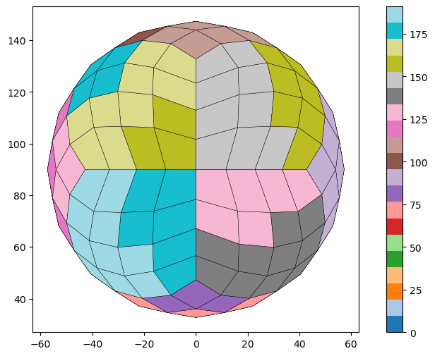
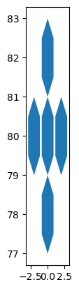

``` python
import geopandas as gpd
import numpy as np
from shapely.geometry import Polygon
import pandas as pdb
import healpy as hp
import pandas as pd
```

<!-- WARNING: THIS FILE WAS AUTOGENERATED! DO NOT EDIT! -->

``` python
def healpix_to_geodataframe(nside: int, pixel_id: int | list[int] | str = 'all', order: str = 'NESTED') -> gpd.GeoDataFrame:
    """
    Converts HEALPix pixel(s) to a GeoDataFrame containing boundary 
    polygon(s) in the WGS84 Geographic CRS (EPSG:4326).

    Args:
        nside: The HEALPix resolution parameter.
        pixel_id: The index of a HEALPix pixel, a list of pixel indices, or 'all' to generate all pixels.
        order: The pixel ordering scheme ('NESTED' or 'RING').

    Returns:
        A geopandas.GeoDataFrame with row(s) representing the cell geometry/geometries.
    """
    
    # Handle 'all' option - generate all pixels for the given nside
    if pixel_id == 'all':
        npix = hp.nside2npix(nside)
        pixel_ids = list(range(npix))
    # Handle single pixel_id or list of pixel_ids
    elif isinstance(pixel_id, int):
        pixel_ids = [pixel_id]
    else:
        pixel_ids = pixel_id
    
    data = []
    
    for pid in pixel_ids:
        # 1. Get vertices in spherical coordinates (theta, phi)
        # theta (colatitude) is 0 at North Pole, pi at South Pole
        # phi (longitude) is 0 to 2*pi
        # hp.boundaries returns shape (2, n_vertices) where first row is theta, second is phi
        vertices = hp.boundaries(nside, pid, step=1, nest=(order == 'NESTED'))
        vertices_theta = vertices[0]
        vertices_phi = vertices[1]

        # 2. Convert spherical coordinates to geographic (lat, lon) in degrees
        # Latitude (lat): 90 - degrees(theta)
        # Longitude (lon): degrees(phi)
        vertices_lat = np.degrees(np.pi/2 - vertices_theta)
        vertices_lon = np.degrees(vertices_phi)
        
        # 3. Handle longitude wrapping (for cells crossing the anti-meridian,
        # ensuring longitudes are in the range [-180, 180])
        vertices_lon[vertices_lon > 180] -= 360

        # 4. Create Shapely Polygon from (lon, lat) coordinates
        # Shapely/GeoPandas expects (lon, lat) order
        cell_polygon = Polygon(zip(vertices_lon, vertices_lat))

        # 5. Add to data list
        data.append({
            'pixel_id': pid,
            'nside': nside,
            'order': order,
            'geometry': cell_polygon
        })
    
    # Create GeoDataFrame
    gdf = gpd.GeoDataFrame(
        data,
        crs='EPSG:4326' # Standard WGS84 Geographic CRS
    )
    
    return gdf
```

``` python
pd.options.display.max_colwidth = 1000
```

``` python
# Example with all pixels for nside=8 (generates 768 pixels)
gdf_multi = healpix_to_geodataframe(nside=4, pixel_id='all')
gdf_multi
```

<div>
<style scoped>
    .dataframe tbody tr th:only-of-type {
        vertical-align: middle;
    }
&#10;    .dataframe tbody tr th {
        vertical-align: top;
    }
&#10;    .dataframe thead th {
        text-align: right;
    }
</style>

<table class="dataframe" data-quarto-postprocess="true" data-border="1">
<thead>
<tr class="header" style="text-align: right;">
<th data-quarto-table-cell-role="th"></th>
<th data-quarto-table-cell-role="th">pixel_id</th>
<th data-quarto-table-cell-role="th">nside</th>
<th data-quarto-table-cell-role="th">order</th>
<th data-quarto-table-cell-role="th">geometry</th>
</tr>
</thead>
<tbody>
<tr class="odd">
<td data-quarto-table-cell-role="th">0</td>
<td>0</td>
<td>4</td>
<td>NESTED</td>
<td>POLYGON ((38.19719 51.80281, 31.38661 43.02662, 40.51423 49.48577,
46.97338 58.61339, 38.19719 51.80281))</td>
</tr>
<tr class="even">
<td data-quarto-table-cell-role="th">1</td>
<td>1</td>
<td>4</td>
<td>NESTED</td>
<td>POLYGON ((41.25719 62.43283, 38.19719 51.80281, 46.97338 58.61339,
49.90703 69.32783, 41.25719 62.43283))</td>
</tr>
<tr class="odd">
<td data-quarto-table-cell-role="th">2</td>
<td>2</td>
<td>4</td>
<td>NESTED</td>
<td>POLYGON ((27.56717 48.74281, 20.67217 40.09297, 31.38661 43.02662,
38.19719 51.80281, 27.56717 48.74281))</td>
</tr>
<tr class="even">
<td data-quarto-table-cell-role="th">3</td>
<td>3</td>
<td>4</td>
<td>NESTED</td>
<td>POLYGON ((30.19753 59.80247, 27.56717 48.74281, 38.19719 51.80281,
41.25719 62.43283, 30.19753 59.80247))</td>
</tr>
<tr class="odd">
<td data-quarto-table-cell-role="th">4</td>
<td>4</td>
<td>4</td>
<td>NESTED</td>
<td>POLYGON ((39.45497 73.65722, 41.25719 62.43283, 49.90703 69.32783,
48.66617 80.3197, 39.45497 73.65722))</td>
</tr>
<tr class="even">
<td data-quarto-table-cell-role="th">...</td>
<td>...</td>
<td>...</td>
<td>...</td>
<td>...</td>
</tr>
<tr class="odd">
<td data-quarto-table-cell-role="th">187</td>
<td>187</td>
<td>4</td>
<td>NESTED</td>
<td>POLYGON ((-49.90703 69.32783, -48.66617 80.3197, -39.45497 73.65722,
-41.25719 62.43283, -49.90703 69.32783))</td>
</tr>
<tr class="even">
<td data-quarto-table-cell-role="th">188</td>
<td>188</td>
<td>4</td>
<td>NESTED</td>
<td>POLYGON ((-38.19719 51.80281, -41.25719 62.43283, -30.19753
59.80247, -27.56717 48.74281, -38.19719 51.80281))</td>
</tr>
<tr class="odd">
<td data-quarto-table-cell-role="th">189</td>
<td>189</td>
<td>4</td>
<td>NESTED</td>
<td>POLYGON ((-31.38661 43.02662, -38.19719 51.80281, -27.56717
48.74281, -20.67217 40.09297, -31.38661 43.02662))</td>
</tr>
<tr class="even">
<td data-quarto-table-cell-role="th">190</td>
<td>190</td>
<td>4</td>
<td>NESTED</td>
<td>POLYGON ((-46.97338 58.61339, -49.90703 69.32783, -41.25719
62.43283, -38.19719 51.80281, -46.97338 58.61339))</td>
</tr>
<tr class="odd">
<td data-quarto-table-cell-role="th">191</td>
<td>191</td>
<td>4</td>
<td>NESTED</td>
<td>POLYGON ((-40.51423 49.48577, -46.97338 58.61339, -38.19719
51.80281, -31.38661 43.02662, -40.51423 49.48577))</td>
</tr>
</tbody>
</table>

<p>192 rows × 4 columns</p>
</div>

``` python
ax = gdf_multi.plot(
    column='pixel_id',    # use 'column' not 'color'
    cmap='tab20', 
    legend=True, 
    figsize=(10, 6), 
    linewidth=0.3, 
    edgecolor='black'
)
ax.set_aspect('equal')
```



``` python
def generate_wgs84_polygons(centers: list[tuple[float, float]], 
                            n_sides: int, 
                            radius_deg: float, 
                            rotation_deg: float = 0.0) -> gpd.GeoDataFrame:
    """
    Generates a GeoDataFrame containing regular N-sided polygons 
    (e.g., hexagons, squares) centered at specified lon/lat coordinates.

    NOTE: The 'radius_deg' defines the size in degrees of longitude/latitude space.
          This function is for visual/modeling purposes where WGS84 coordinates 
          are used as a flat Cartesian plane (non-geographical analysis).

    Args:
        centers: A list of tuples, where each tuple is (longitude, latitude) 
                 for the center of a polygon.
        n_sides: The number of sides of the regular polygon (e.g., 6 for a hexagon).
        radius_deg: The radius of the polygon in degrees (distance from center 
                    to a vertex).
        rotation_deg: The rotation angle of the polygon in degrees 
                      (0 degrees means a side or vertex points North/East).

    Returns:
        A geopandas.GeoDataFrame with the generated polygons, CRS is WGS84 (EPSG:4326).
    """
    polygons_data = []
    
    # Convert rotation angle to radians
    rotation_rad = np.radians(rotation_deg)
    
    # Calculate the angles for the vertices
    # Start angle adjusts for the initial rotation
    angles = np.linspace(0, 2 * np.pi, n_sides, endpoint=False) + rotation_rad
    
    for i, (center_lon, center_lat) in enumerate(centers):
        
        # Calculate x and y coordinates of vertices relative to the center
        # Since we treat lon/lat as a Cartesian plane, use simple trig:
        x_vertices = center_lon + radius_deg * np.cos(angles)
        y_vertices = center_lat + radius_deg * np.sin(angles)
        
        # Create Shapely Polygon from (lon, lat) coordinates
        # zip(x_vertices, y_vertices) provides (lon, lat) tuples
        polygon = Polygon(zip(x_vertices, y_vertices))
        
        polygons_data.append({
            'id': i,
            'center_lon': center_lon,
            'center_lat': center_lat,
            'geometry': polygon
        })

    # Create GeoDataFrame with WGS84 CRS
    gdf = gpd.GeoDataFrame(
        polygons_data,
        crs='EPSG:4326' 
    )
    
    return gdf
```

``` python
# --- Example Usage (Do not run) ---
# Define centers for a small cluster similar to the logo:
center_pts = np.array([
    (0.0, 0.0), 
    (2.0, 0.0), 
    (-2.0, 0.0), 
    (0.0, 2.0),
    (0.0, -2.0)
])

fixed_number = 80.0  # adjust this value as needed
center_pts[:, 1] += fixed_number
center_pts

# Generate Hexagons (n_sides=6) with a radius of 1.0 degree, rotated by 30 degrees
gdf_hexagons = generate_wgs84_polygons(
    centers=center_pts, 
    n_sides=6, 
    radius_deg=1.0, 
    rotation_deg=30.0
)

gdf_hexagons.plot()
```


