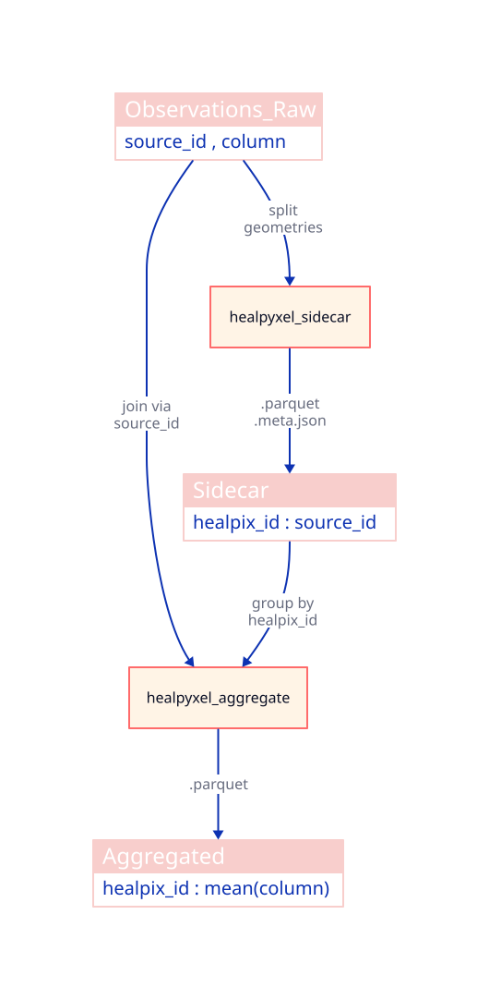
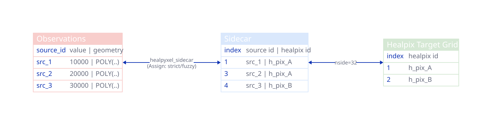
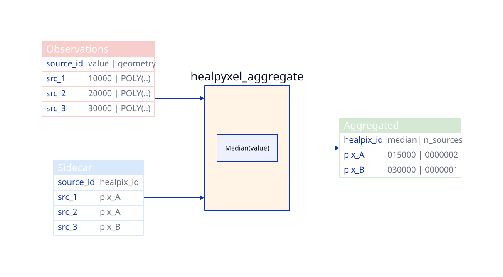
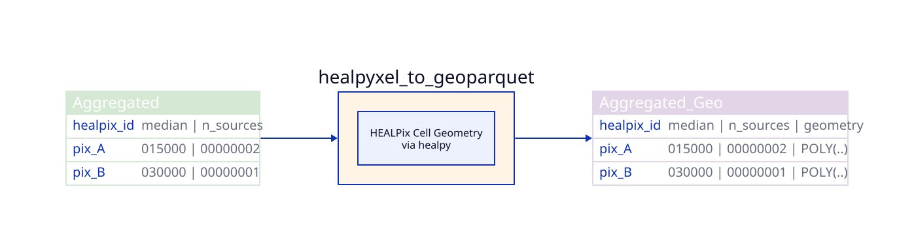
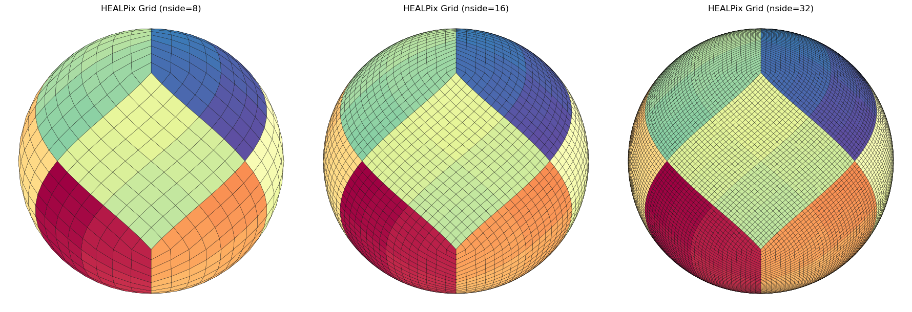

<div style="display: flex; align-items: center; gap: 1rem;">

<div>
<strong>HEALPyxel</strong> — HEALPix-based spatial aggregation for planetary science data.
</div>
</div>


## Overview

This project provides HEALPix-based spatial aggregation for planetary science data, with streaming accumulation, sidecar generation, and batch aggregation capabilities.

## What You'll Learn

Start with the linear path below if you are new to healpyxel:

1. [Core concepts tutorial](../notebooks/01_core_concepts.html) — HEALPix basics, sidecar generation, aggregation
2. [Full workflow tutorial](../notebooks/02_full_workflow.html) — end-to-end pipeline with visualizations
3. [Sphere-native sidecar tutorial](../notebooks/03_sphere_native_sidecar.html) — great-circle SLERP, antimeridian-safe cells

The [API reference](reference/index.qmd) is best used after the tutorial path above.

## Start Here

- [Core concepts tutorial](../notebooks/01_core_concepts.html) — the fastest way to get started.
- [Full workflow tutorial](../notebooks/02_full_workflow.html) — complete pipeline with plots.

## Install

The repository root [README.md](../README.md) has the installation and local setup instructions, including optional dependencies.

## Workflow

1. **Sidecar** — assign MESSENGER/MASCS observations to HEALPix cells with PSF-weighted geometry
2. **Aggregate** — batch sidecar outputs into per-cell statistics
3. **Accumulate** — stream incremental updates with TDigest percentiles and fuzzy mode
4. **Finalize** — densify maps, export to GeoTIFF, and embed metadata

## What is HEALPix?

**HEALPix** (Hierarchical Equal Area isoLatitude Pixelization) is a
standard for partitioning a sphere (like a planet or the sky) into
pixels of equal surface area.

Unlike traditional “rectangular” map projections (like Equirectangular
or Mercator), HEALPix ensures that:

- **Every pixel is the same size:** Statistical analysis remains valid
  across the entire globe, including the poles.
- **It is Hierarchical:** You can easily increase or decrease resolution
  ($NSIDE$) while maintaining spatial relationships.
- **Fast Computation:** Its structure allows for extremely efficient
  neighbor searches and spherical harmonic transforms.

Some useful links:

- [HEALPix - Wikipedia](https://en.wikipedia.org/wiki/HEALPix)
- LandscapeGeoinformatics/[Awesome Discrete Global Grid Systems
  (DGGS)](https://github.com/LandscapeGeoinformatics/awesome-discrete-global-grid-systems?tab=readme-ov-file)
- pangeo-data/[awesome-HEALPix](https://github.com/pangeo-data/awesome-HEALPix):
  A curated list of awesome HEALPix libraries, tools, and resources.

## The Problem: Data Distortion & Scale

In planetary science, data often arrives as **scattered points, tracks,
or footprints** from spectrometers and altimeters. Traditionally,
researchers face two major hurdles:

1.  **Projection Bias:** Standard grids distort the poles, making global
    surface calculations (like mean chemical abundance or crater
    density) mathematically biased.
2.  **The Memory Wall:** Modern missions generate billions of points.
    Loading an entire global high-resolution map into RAM to update it
    is often impossible.

`healpyxel` solves this by treating the sphere as a **modern data
engineering target** rather than just a geometric grid.

## Design Philosophy & Use Cases

`healpyxel` is built on the **Unix Philosophy**: do one thing and do it
well, using a decoupled, chainable structure. It treats HEALPix indexing
as a data-engineering problem rather than just a geometric one.

This package relies heavily on
[healpy](https://healpy.readthedocs.io/en/latest/).

astropy also have a contributed module to handle those grids called
[astropy_healpix](https://astropy-healpix.readthedocs.io/en/latest/).

### Who is this for?

This package is ideal for researchers and data engineers working with
**sparse, irregular, or streaming planetary and astronomical datasets.**

- **Remote Sensing & Planetary Science:** Specifically designed for
  instruments like 1-point spectrometers (e.g., MESSENGER/MASCS), laser
  altimeters, and push-broom spectrometers.
- **The “Sidecar” Workflow:** Index your data without modifying the
  original source files. `healpyxel` creates lightweight “sidecar” files
  that map your GeoParquet rows to HEALPix cells.
- **Large-Scale Data Engineering:** Process TB-scale datasets using a
  **Split-Apply-Combine** approach on GeoParquet.
- **Streaming & Incremental Ingestion:** Update global maps as new data
  arrives without reprocessing the entire historical archive.

### <span style="color: red;">🛑 Who is this NOT for?</span>

You might consider alternatives if your use case falls into these
categories:

- **High-Resolution 2D Imagery:** For dense image-to-HEALPix
  re-projection (e.g., CCD frames), tools like
  [reproject](https://reproject.readthedocs.io/) or
  [astropy-healpix](https://astropy-healpix.readthedocs.io/) are more
  suitable.
- **Standard Xarray/Dask Unstructured Grids:** For deep integration with
  general unstructured meshes beyond HEALPix, use
  [UXarray](https://uxarray.readthedocs.io/).
- **Multi-order Coverage (MOC) & LIGO workflows:** For specific
  gravitational wave IO formats, check out
  [mhealpy](https://mhealpy.readthedocs.io/).

### How it Works: The “Sidecar” Strategy

`healpyxel` implements a **Split-Apply-Combine** pattern tailored for
spherical geometry:

1.  **Split (The Sidecar):** Instead of rewriting your heavy raw data,
    `healpyxel` generates a small Parquet file containing only the
    `index` of the original data and its corresponding `healpix_id`.
2.  **Apply (Aggregation):** Join this sidecar with any column in your
    original dataset to calculate statistics (Mean, Std Dev, Count) per
    cell.
3.  **Combine (The Map):** Results are combined into a final HEALPix map
    or a streaming accumulator.

**💡 Pro-Tip:** For multiple pixels sensors (e.g. push-broom
spectrometer), flatten your 2D acquisitions into a 1D tabular format
(one row per spatial pixel) before saving to GeoParquet. `healpyxel` is
optimized to ingest these “shredded” lines at high speed.

## Installation

This works if you have a working requires C/C++ toolchain (cfitsio,
HEALPix C++ library), I have no way to builts wheels for Windows, see
below for workarounds.

``` bash
pip install healpyxel
```

### Optional Dependencies

``` bash
# For geospatial operations (sidecar generation)
pip install healpyxel[geospatial]

# For streaming/incremental statistics (accumulator)
pip install healpyxel[streaming]

# For visualization (maps, plots)
pip install healpyxel[viz]

# Development tools (nbdev, testing, linting)
pip install healpyxel[dev]

# All optional dependencies
pip install healpyxel[all]
```

**Windows Users workarounds**:

- Option 1: Use conda (RECOMMENDED)

``` bash
conda install -c conda-forge healpy
pip install healpyxel
```

Conda-forge provides prebuilt Windows binaries.

- Option 2: WSL2 (Windows Subsystem for Linux)

``` bash
# In WSL2 Ubuntu
pip install healpyxel
```

**Extras breakdown:** - `geospatial`: geopandas, shapely,
dask-geopandas, antimeridian (required for `healpyxel_sidecar`) -
`streaming`: tdigest (percentile tracking in `healpyxel_accumulator`) -
`viz`: matplotlib, scikit-image, skyproj (mapping workflows) - `dev`:
All of the above + nbdev, pytest, black, ruff, mypy - `all`: Installs
geospatial + streaming + viz (excludes dev tools)

## Quick Start

The **healpyxel workflow** implements spatial aggregation using three
core steps:

1.  *Split*: Map observations to HEALPix cells `healpyxel_sidecar`
2.  and 3. *Apply+Combine*: Aggregate values per HEALPix cell
    `healpyxel_aggregate`



### 1. **Split**: Map observations to HEALPix cells

You start with observation data (GeoParquet): geometries + values per
record. A **sidecar** file links each observation (`source_id`) to
HEALPix cells at your target resolution (`nside`).

**Data contract:**

- Input: `observations.parquet` → columns: `source_id`, `value`,
  `geometry`
- Output: `observations-sidecar.parquet` → columns: `source_id`,
  `healpix_id`, `weight` (fuzzy mode only)

**CLI:**
`healpyxel_sidecar --input observations.parquet --nside 64 128 --mode fuzzy`



### 2. **Apply + Combine**: Aggregate values per HEALPix cell

Group all observations assigned to the same cell and compute statistics
(median, mean, MAD, robust_std, etc.).

**Data contract:**

- Input: `observations.parquet` + sidecar file
- Output: `observations-aggregated.parquet` → columns: `healpix_id`,
  `value_median`, `value_robust_std`, …

**CLI:**
`healpyxel_aggregate --input observations.parquet --sidecar-dir output/ --columns value --aggs median robust_std`



### Optional : Attach HEALPix cell geometry

Add polygon boundaries to aggregated cells (computed from `healpix_id`
via `healpy`).

Resulting GeoParquet files can be direclty imported in QGIS and other
GIS programs.

**Data contract:**

- Input: `observations-aggregated.parquet`
- Output: `observations-aggregated.geo.parquet` → adds column:
  `geometry` (HEALPix cell polygon)

**CLI:**
`healpyxel_to_geoparquet --aggregate-path observations-aggregated.parquet --output-dir output/`



## Optional: Cache geometries

Pre-compute HEALPix cell boundaries for faster repeated use (especially
for high `nside`). This example create the 8,16 and 36 grid and convert
the cached files to geoparquet that geopandas can directly read and
visualize.

**CLI:**

``` bash
# create the grids
healpyxel_cache --nside 8 16 32 --order nested --lon-convention 0_360

# list them
healpyxel_cache --list
Cache directory: $XDG_HOME/.cache/healpyxel/healpix_grids
Cached grids (7):
  nside_008_nest_spherical.parquet                 768 cells      0.0 MB
  nside_016_nest_spherical.parquet                3072 cells      0.1 MB
  nside_032_nest_spherical.parquet               12288 cells      0.2 MB

# create geoparquet versions, store in tmp
for grid in $HOME/.cache/healpyxel/healpix_grids/*
do
    echo "processin $grid file" 
    healpyxel_to_geoparquet -a $grid -d /tmp/ -l -180_180 -f
done
```

minimal python example to read plot one of those:

``` python
import geopandas as gpd
import cartopy.crs as ccrs
projection = ccrs.Orthographic(central_longitude=0, central_latitude=0)
fig, ax = plt.subplots(figsize=(10, 10))
gdf_projected_8.plot(
    column=gdf.index,  # Color by healpix_id
    cmap='Spectral_r',
    legend=False,
    edgecolor='black',
    linewidth=0.8,
    ax=ax
)
ax.set_aspect('equal')
```



### Batch Processing

see [below](#cli-workflow)

``` bash
# 1. Generate HEALPix sidecar (SPLIT)
healpyxel_sidecar \
  --input observations.parquet \
  --nside 64 128 \
  --mode fuzzy \
  --output-dir output/

# 2. Aggregate by HEALPix cells (APPLY)
healpyxel_aggregate \
  --input observations.parquet \
  --sidecar-dir output/ \
  --sidecar-index 0 \
  --aggregate \
  --columns r750 r950 \
  --aggs median robust_std \
  --min-count 3

# 3. Convert to GeoParquet (for visualization)
healpyxel_to_geoparquet \
  --aggregate-path output/observations-aggregated.*.parquet \
  --output-dir output/ \
  --lon-convention -180_180

# 4. Cache HEALPix geometry (optional, speeds up visualization)
healpyxel_cache --nside 64 128 --order nested --lon-convention 0_360
```

### Streaming Processing - WORK IN PROGRESS

``` bash
# Day 1: Initialize accumulator
healpyxel_accumulate --input day001.parquet \
  --columns r750 r950 --state-output state_v001.parquet

# Day 2+: Incremental updates
healpyxel_accumulate --input day002.parquet \
  --columns r750 r950 \
  --state-input state_v001.parquet --state-output state_v002.parquet

# Finalize to statistics
healpyxel_finalize --state state_v030.parquet --output mosaic.parquet \
  --percentiles 25 50 75 --densify --nside 512
```

## CLI Workflow

This section explan a full CLI workflow on a test sample 50k data,
including the outputs produced at each stage.

The same workflow is done completely in python with healpyxel API in
[Examples\>Visualization](example_visualization_workflow.html) section.

All input/output are in this repsitory:

- script is at
  [examples/cli_regrid_sample_50k.sh](examples/cli_regrid_sample_50k.sh)
- input are at
  [test_data/samples/sample_50k.parquet](test_data/samples/sample_50k.parquet)
- ouput are in
  [test_data/derived/cli_quickstart](test_data/derived/cli_quickstart)

```{python}
#| label: setup-cli-workflow-vars
#| echo: false
import geopandas as gpd
import pandas as pd
import numpy as np
import matplotlib.pyplot as plt
from pathlib import Path
import json
from healpyxel.geospatial import healpix_to_geodataframe

cli_output_dir = Path("../test_data/derived/cli_quickstart")

plot_config_base_dict = {
    "alpha": 1.0,
    "edgecolor": "k",
    "figsize": (10, 10 / 1.61803398875),
    "aspect": 1 / 1.61803398875,
    "cmap": plt.cm.viridis_r,
    "legend": False,
}

orignal_plot_config_dict = plot_config_base_dict.copy()
orignal_plot_config_dict.update({"column": "ang_phase"})

aggregated_plot_config_dict = plot_config_base_dict.copy()
aggregated_plot_config_dict.update({"column": "r1050_mean"})

sidecar_meta_path = cli_output_dir / "sample_50k.cell-healpix_assignment-fuzzy_nside-32_order-nested.meta.json"
sidecar_path = None
original_path = None
sidecar_nside_32_df = None
aggregated_geo_sparse_nside_32_df = None
aggregated_sparse_nside_32_df = None
aggregated_dense_nside_32_df = None
original_df = None
pixels_32 = None
cell_pixels_nside_32_df = None

if sidecar_meta_path.exists():
    with open(sidecar_meta_path, "r") as f:
        sidecar_metadata = json.load(f)
    original_path = Path(sidecar_metadata["processing"]["source_file"])
    sidecar_path = Path(sidecar_metadata["processing"]["output_file"])

if sidecar_path and sidecar_path.exists():
    sidecar_nside_32_df = pd.read_parquet(sidecar_path)
    aggregated_geo_sparse_nside_32_path = (
        cli_output_dir
        / "sample_50k-aggregated.cell-healpix_assignment-fuzzy_nside-32_order-nested.geo.parquet"
    )
    if aggregated_geo_sparse_nside_32_path.exists():
        aggregated_geo_sparse_nside_32_df = gpd.read_parquet(
            aggregated_geo_sparse_nside_32_path
        )
    aggregated_sparse_nside_32_path = (
        cli_output_dir
        / "sample_50k-aggregated.cell-healpix_assignment-fuzzy_nside-32_order-nested.parquet"
    )
    if aggregated_sparse_nside_32_path.exists():
        aggregated_sparse_nside_32_df = pd.read_parquet(aggregated_sparse_nside_32_path)
    aggregated_dense_nside_32_path = (
        cli_output_dir
        / "sample_50k-aggregated-densified.cell-healpix_assignment-fuzzy_nside-32_order-nested.parquet"
    )
    if aggregated_dense_nside_32_path.exists():
        aggregated_dense_nside_32_df = pd.read_parquet(aggregated_dense_nside_32_path)
    if original_path and original_path.exists():
        original_df = gpd.read_parquet(original_path)
        initial_pixel = sidecar_nside_32_df["source_id"].iloc[0]
        initial_healpix = sidecar_nside_32_df.query(
            f"source_id == {initial_pixel}"
        ).healpix_id.values[0]
        pixels_32 = np.arange(0, 4) + initial_healpix
        gdf_cells = healpix_to_geodataframe(
            nside=32,
            order="nested",
            lon_convention="0_360",
            pixels=pixels_32,
            fix_antimeridian=True,
            cache_mode="use",
        ).reset_index(drop=False)
        cell_pixels_nside_32_df = (
            sidecar_nside_32_df.query("healpix_id in @pixels_32")
            .source_id.values
        )
```

```{python}
#| label: fig-original-data-plot
#| fig-cap: "Original sample_50k.parquet — GeoDataFrame plot colored by phase angle"
#| echo: false

if original_df is not None:
    ax = original_df.query(
        "(-20 < lat_center < -15) and (260 < lon_center < 265)"
    ).plot(**orignal_plot_config_dict)
    ax.set_title("Orginal Data Geopandas Plot \n color : phase angle ")
    ax.set_xlabel("Longitude")
    ax.set_ylabel("Latitude")
else:
    print("Original data not loaded — run the CLI script first")
```

```{python}
#| label: tbl-original-data
#| tbl-cap: "Original files excerpt (transposed for clarity)"
#| echo: false

input_path = Path("../test_data/samples/sample_50k.parquet")
if input_path.exists():
    df = pd.read_parquet(input_path)
    cols = [c for c in ["lat_center", "lon_center", "ang_incidence",
                         "ang_emission", "ang_phase", "azimuth", "geometry"]
            if c in df.columns]
    display(df[cols].head(4))
else:
    print("Test data not found — run: bash examples/cli_regrid_sample_50k.sh")
```

```{python}
#| label: tbl-sidecar-data
#| tbl-cap: "Sidecar metadata and first 10 rows"
#| echo: false
if sidecar_meta_path.exists():
    sidecar_df = pd.read_parquet(sidecar_path)
    print(f"Sidecar Metadata:")
    print(f"Unique sources: {sidecar_df['source_id'].nunique()}")
    print(f"  Unique HEALPix cells: {sidecar_df['healpix_id'].nunique()}")
    print(f"  Total assignments: {len(sidecar_df)}")
    print(f"\n  Sidecar Data:")
    display(sidecar_df.head(10))
else:
    print(f"Sidecar metadata not found: {sidecar_meta_path}")
    print("Run the CLI script first: bash examples/cli_regrid_sample_50k.sh")
```

### 1) Create HEALPix sidecar(s)

Those files link each row in the input parquet file to the HEALPix cells
at the requested **nside** resolution; see [Useful Healpix data for Moon
Venus Mercury](#useful-healpix-data-for-moon-venus-mercury) for some
cells data. Refer to `healpyxel_sidecar --help` for full options. The
`--mode` flag is especially important: - `fuzzy`: assign each input
record to every cell it touches - `strict`: assign only records fully
contained within a cell

``` bash
healpyxel_sidecar \
  --input "test_data/samples/sample_50k.parquet" \
  --nside 32 64 \
  --mode fuzzy \
  --lon-convention 0_360 \
  --output_dir "test_data/derived/cli_quickstart"
```

**Outputs**

- sample_50k.cell-healpix_assignment-fuzzy_nside-32_order-nested.parquet
- sample_50k.cell-healpix_assignment-fuzzy_nside-32_order-nested.meta.json
- sample_50k.cell-healpix_assignment-fuzzy_nside-64_order-nested.parquet
- sample_50k.cell-healpix_assignment-fuzzy_nside-64_order-nested.meta.json

<!-- -->

```{python}
#| label: tbl-sidecar-head
#| tbl-cap: "Sidecar head for nside 32"
#| echo: false
if sidecar_meta_path.exists():
    sidecar_df = pd.read_parquet(sidecar_path)
    print(f"Nside 32: {len(sidecar_df)} assignments, {sidecar_df['healpix_id'].nunique()} unique cells")
    display(sidecar_df.head())
else:
    print(f"Sidecar metadata not found: {sidecar_meta_path}")
```


```{python}
#| echo: false
#| label: original-data-over_healpix-grid
#| fig-cap: "Original data plot and matching Healpix grid cells"

aggregated_geo_sparse_nside_32_path = cli_output_dir / 'sample_50k-aggregated.cell-healpix_assignment-fuzzy_nside-32_order-nested.geo.parquet'

aggregated_geo_sparse_nside_32_df = gpd.read_parquet(aggregated_geo_sparse_nside_32_path)

# take an initial pixel, say:
original_pixel = 21349

initial_healpix = sidecar_nside_32_df.query(f'source_id == {original_pixel}').healpix_id.values[0]

from matplotlib import axes
from healpyxel.geospatial import healpix_to_geodataframe

pixels_32 = np.arange(0,4)+initial_healpix
gdf_cells = healpix_to_geodataframe(
    nside=32,              # set or infer from metadata
    order='nested',
    lon_convention='0_360',
    pixels=pixels_32,
    fix_antimeridian=True,
    cache_mode='use'
).reset_index(drop=False)

ax= gdf_cells.plot(color='none', edgecolor='k', figsize=orignal_plot_config_dict['figsize'], aspect=orignal_plot_config_dict['aspect'])

cell_pixels_nside_32_df = sidecar_nside_32_df.query('healpix_id in @pixels_32').source_id.values

ax = original_df.loc[cell_pixels_nside_32_df].plot(**orignal_plot_config_dict, ax=ax)

# Annotate each polygon with its healpix_id (index)
for idx, row in aggregated_geo_sparse_nside_32_df.loc[pixels_32].iterrows():
    if row.geometry.is_empty or not row.geometry.is_valid:
        continue
    # Get centroid for label placement
    centroid = row.geometry.centroid
    ax.text(
        centroid.x-.5, centroid.y+.35, f'pixel.{int(idx)}',
        fontsize=10, color='black', ha='center', va='center',
        bbox=dict(facecolor='white', alpha=0.5, edgecolor='none', boxstyle='round,pad=0.2')
    )


ax.set_title('Orginal Data Geopandas Plot over nside=32 HEALPix  grid')
ax.set_xlabel('Longitude');
ax.set_ylabel('Latitude');

```

### 2) Aggregate sparse regridded map(s)

Now we need to aggregate initial data on the cells, refer to
`healpyxel_aggregate --help` for all the option. Some flag are
particurarly useful:

- `--schema` : show input parquet schema, useful to look which data are
  there to aggregate.
- `--list-sidecars` : list available sidecar for an input files, they
  are addressed by index.
- `--sidecar-schema INDEX` : show schema for specific sidecar file
- `--aggs mean` : aggregation functions (choices: mean, median, std,
  min, max, mad, robust_std).

Example :

- input file contains columns A (you can check it with
  `healpyxel_aggregate -i input --schema`)
- `--agg mean median std`
- this produce un output the columns `A_mean`, `A_median` and `A_std`
  created appling those function on all input files rows listd in the
  sidecar file for a single HEALPix cell

``` bash
healpyxel_aggregate \
  --input "test_data/samples/sample_50k.parquet" \
  --sidecar-dir "test_data/derived/cli_quickstart" \
  --sidecar-index all \
  --aggregate \
  --columns r1050 \
  --aggs mean median std mad robust_std \
```

This produces sparse output : only cells with actual values are written
in ouput.

**Outputs** -
sample_50k-aggregated.cell-healpix_assignment-fuzzy_nside-32_order-nested.parquet -
sample_50k-aggregated.cell-healpix_assignment-fuzzy_nside-32_order-nested.meta.json -
sample_50k-aggregated.cell-healpix_assignment-fuzzy_nside-64_order-nested.parquet -
sample_50k-aggregated.cell-healpix_assignment-fuzzy_nside-64_order-nested.meta.json

```{python}
#| label: tbl-aggregated-sparse
#| tbl-cap: "Aggregated sparse output (nside 32) — only cells with data"
#| echo: false
aggregated_sparse_nside_32_path = cli_output_dir / 'sample_50k-aggregated.cell-healpix_assignment-fuzzy_nside-32_order-nested.parquet'
aggregated_sparse_nside_32_df = pd.read_parquet(aggregated_sparse_nside_32_path)
print(f"Nside 32: {len(aggregated_sparse_nside_32_df)} unique cells")
display(aggregated_sparse_nside_32_df.head())
```

### 3) Aggregate densified regridded map(s)

``` bash
healpyxel_aggregate \
  --input "test_data/samples/sample_50k.parquet" \
  --sidecar-dir "test_data/derived/cli_quickstart" \
  --sidecar-index all \
  --aggregate \
  --columns r1050 \
  --aggs mean median std mad robust_std \
  --densify
```

This produces dense output : all HEALPix cells are writeen in ouput,
empty one as filled with Nan.

**Outputs**

- sample_50k-aggregated-densified.cell-healpix_assignment-fuzzy_nside-32_order-nested.parquet
- sample_50k-aggregated-densified.cell-healpix_assignment-fuzzy_nside-32_order-nested.meta.json
- sample_50k-aggregated-densified.cell-healpix_assignment-fuzzy_nside-64_order-nested.parquet
- sample_50k-aggregated-densified.cell-healpix_assignment-fuzzy_nside-64_order-nested.meta.json

```{python}
#| label: tbl-aggregated-dense
#| tbl-cap: "Aggregated densified output (nside 32) — all HEALPix cells including empty ones"
#| echo: false
aggregated_dense_nside_32_path = cli_output_dir / 'sample_50k-aggregated-densified.cell-healpix_assignment-fuzzy_nside-32_order-nested.parquet'
aggregated_dense_nside_32_df = pd.read_parquet(aggregated_dense_nside_32_path)
print(f"Nside 32: {len(aggregated_dense_nside_32_df)} unique cells <- densified, "
      f"{len(aggregated_dense_nside_32_df) - len(aggregated_sparse_nside_32_df)} additional empty cells")
display(aggregated_dense_nside_32_df.loc[29:45])
```

### 4) Convert aggregated maps to GeoParquet

This convert each aggregated file to a geoparquet.

``` bash
for f in "test_data/derived/cli_quickstart"/*-aggregated*parquet; do
  healpyxel_to_geoparquet -a "$f" -d "test_data/derived/cli_quickstart" -l -180_180 -f
done
```

**Outputs**

- sample_50k-aggregated-densified.cell-healpix_assignment-fuzzy_nside-32_order-nested.geo.parquet
- sample_50k-aggregated-densified.cell-healpix_assignment-fuzzy_nside-64_order-nested.geo.parquet
- sample_50k-aggregated.cell-healpix_assignment-fuzzy_nside-32_order-nested.geo.parquet
- sample_50k-aggregated.cell-healpix_assignment-fuzzy_nside-64_order-nested.geo.parquet

```{python}
#| label: tbl-geo-sparse
#| tbl-cap: "GeoParquet aggregated sparse output (nside 32)"
#| echo: false
print(f"Nside 32: {len(aggregated_geo_sparse_nside_32_df)} unique cells")
display(aggregated_geo_sparse_nside_32_df.head())
```

Each cell is linked to some initial observation via the sidecar file, we
can see here the distribution of one value in all the cell

```{python}
#| label: fig-distribution-selected-cells
#| fig-cap: "Distribution of values within selected HEALPix cells, with mean/median lines"
#| echo: false
selected_cells = sidecar_nside_32_df.query("healpix_id in @pixels_32").drop(
    columns=["weight"]
).copy()
grouped = (
    original_df.loc[cell_pixels_nside_32_df][[orignal_plot_config_dict["column"]]]
    .reset_index(drop=False)
    .rename(columns={"index": "source_id"})
    .merge(selected_cells, on="source_id", how="inner")
    .groupby("healpix_id")
)
fig, axes = plt.subplots(
    2,
    2,
    figsize=(
        orignal_plot_config_dict["figsize"][0],
        orignal_plot_config_dict["figsize"][0] * orignal_plot_config_dict["aspect"],
    ),
)
axes = axes.flatten()

for idx, (healpix_id, group) in enumerate(grouped):
    ax = axes[idx]
    values = group[orignal_plot_config_dict["column"]]
    values.hist(bins=20, ax=ax, edgecolor="k", alpha=0.7)
    mean_val = values.mean()
    median_val = values.median()
    ax.axvline(
        mean_val, color="red", linestyle="--", linewidth=2,
        label=f"Mean: {mean_val:.2f}",
    )
    ax.axvline(
        median_val, color="blue", linestyle="--", linewidth=2,
        label=f"Median: {median_val:.2f}",
    )
    ax.set_title(f"HEALPix pixel:{int(healpix_id)} (observations: {len(group)})")
    ax.set_xlabel(orignal_plot_config_dict["column"])
    ax.set_ylabel("Frequency")
    ax.grid(True, alpha=0.3)
    ax.legend(loc="best")

plt.suptitle(
    "Distribution of Original Data Values within Selected HEALPix Cells",
    fontsize=16,
)
plt.tight_layout()
```

We can visualize each pixel with one of the aggregator function output
available in `healpyxel_aggregate` :

- **`mean`**: Arithmetic mean
- **`median`**: Median (50th percentile)
- **`std`**: Standard deviation
- **`min`**: Minimum value
- **`max`**: Maximum value
- **`mad`**: Median Absolute Deviation (robust to outliers)
- **`robust_std`**: MAD × 1.4826 (equivalent to standard deviation for
  normal distributions, robust to outliers)

Each function generates one output column per input value column, named
`<column>_<agg>` (e.g., `r1050_mean`, `r1050_median`, `r1050_mad`).
Robust statistics (`mad`, `robust_std`) are recommended for
outlier-prone datasets.

```{python}
#| echo: false
#| label: original-data-over_healpix-grid-with-values
#| fig-cap: "Original data plot and matching Healpix grid cells clored by average"

ax = aggregated_geo_sparse_nside_32_df.loc[pixels_32].plot(
    **aggregated_plot_config_dict
)
for idx, row in aggregated_geo_sparse_nside_32_df.loc[pixels_32].iterrows():
    if row.geometry.is_empty or not row.geometry.is_valid:
        continue
    centroid = row.geometry.centroid
    ax.text(
        centroid.x - 0.5,
        centroid.y + 0.325,
        f"pixel.{int(idx)}",
        fontsize=10,
        color="black",
        ha="center",
        va="center",
        bbox=dict(
            facecolor="white",
            alpha=0.5,
            edgecolor="none",
            boxstyle="round,pad=0.2",
        ),
    )
original_df.loc[cell_pixels_nside_32_df].plot(
    **orignal_plot_config_dict, ax=ax
)
ax.set_title("Orginal Data Geopandas Plot over nside=32 HEALPix  grid")
ax.set_xlabel("Longitude")
ax.set_ylabel("Latitude")
```

## Python API

Minimal end-to-end python API example, each level works on previous one
output.

- `initial data` → <!-- raw observations (GeoDataFrame/DataFrame) -->
- `sidecar` : generate data \<\> healpix grid connections →
  <!-- maps source_id to healpix_id -->
- `aggregate` → <!-- per-cell statistics on value columns -->
- `attach geometry` → <!-- add HEALPix cell polygons -->
- `accumulate` → <!-- streaming state update (count/mean/m2/tdigest) -->
- `finalize` <!-- final statistics from state -->

minimal code, a more detailed explanation is in
[Examples\>Visualization](example_visualization_workflow.html) section.

------------------------------------------------------------------------

## Developed for MESSENGER/MASCS

This package was developed to process spectral observations from the
MESSENGER/MASCS instrument studying Mercury’s surface. The workflow
handles:

- Millions of observations with complex footprint geometries
- Multi-spectral reflectance data (VIS + NIR)
- Streaming data from ongoing missions
- Native resolution mosaics (sub-footprint sampling)

While designed for MASCS, healpyxel is general-purpose and works with
any planetary science dataset in GeoParquet format.


## HEALPix Cell Sizes: Mercury, Moon, Venus

The table below shows how HEALPix cell size scales with `nside` for
the three bodies most relevant to this project.  Values are generated
by [`healpyxel.core.healpix_cell_sizes()`](reference/core.healpix_cell_sizes.qmd)
using a spherical approximation (radius as input).

```{python}
#| label: tbl-healpix-cell-sizes
#| tbl-cap: "HEALPix cell sizes for Mercury, Moon, and Venus"
#| echo: false

from healpyxel.core import healpix_cell_sizes

table = healpix_cell_sizes(
    radii=[
        ("Mercury Cell Size (2439.7 km)", 2439.7),
        ("Moon Cell Size (1737.4 km)", 1737.4),
        ("Venus Cell Size (6051.8 km)", 6051.8),
    ]
)
table
```


## License

Apache 2.0